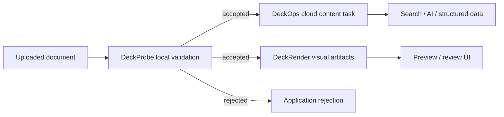

Use this page after choosing the result your application needs. Each workflow identifies the starting input, product sequence, final contract, and the point where document bytes leave the local machine.

| Application goal | Recommended path | Final result |
| --- | --- | --- |
| Gate an upload before cloud processing | DeckProbe → application policy | Accept, reject, or route |
| Build search, RAG, or document understanding | DeckOps Parse | Markdown or structured content |
| Add previews to a review interface | DeckRender | Images, PDF, or supported video |
| Personalize an existing presentation | DeckUse | Updated editable PPTX |
| Generate a presentation from application data | DeckHTML | PPTX with mapping diagnostics, or PNG images |
| Validate, parse, and preview one upload | DeckProbe → DeckOps → DeckRender | Policy, content, and visual artifacts |

## Common agent scenarios

For agent workflows, the three runtime questions map to DeckProbe, DeckRender, and DeckOps: determine what a file is and how to route it, create the visual view an application needs, or parse and operate on document content in the cloud.

### DeckProbe: decide before upload

<CardGroup cols={2}>
  <Card title="Attachment preflight and routing" icon="route" iconType="solid" href="/deckprobe/overview">
    Verify the real format, encryption, macros, structure, counts, and asset facts locally before an agent selects its next tool.
  </Card>
  <Card title="Batch inventory and policy checks" icon="boxes-stacked" iconType="solid" href="/deckprobe/cli/automation-and-output">
    Process many files through JSONL, resource budgets, stable reports, and exit statuses for gateways or document inventories.
  </Card>
</CardGroup>

### DeckRender: create visual views

<CardGroup cols={2}>
  <Card title="Multimodal document viewing" icon="eye" iconType="solid" href="/deckrender/overview">
    Produce page or slide images that an application can use for model input, review interfaces, thumbnails, or human inspection.
  </Card>
  <Card title="Preview and delivery artifacts" icon="images" iconType="solid" href="/deckrender/formats">
    Choose an implemented image, PDF, or video route and review its format-specific fidelity and execution boundary.
  </Card>
</CardGroup>

### DeckOps: parse and operate in the cloud

<CardGroup cols={2}>
  <Card title="Search, RAG, and content understanding" icon="file-lines" iconType="solid" href="/deckops/parse">
    Parse supported documents into Markdown or format-specific structured results for indexing, retrieval, and agent input.
  </Card>
  <Card title="Conversion and cloud document tasks" icon="gears" iconType="solid" href="/deckops/operations">
    Select extraction, conversion, OCR, presentation, image, file, or generation task families for a cloud workflow.
  </Card>
</CardGroup>

DeckProbe, DeckRender, and DeckOps expose separate calls and result contracts. Combine only the products required by the application; one product does not automatically invoke the others.

## Gate document uploads before cloud processing

Start withAn untrusted PDF, Office, or modern iWork file received by your application.

<Steps>
  <Step title="Inspect locally">Run DeckProbe for identity, encryption, macro, structure, count, or asset targets.</Step>
  <Step title="Apply policy">Evaluate the Schema v2 evidence with your application's acceptance and routing rules.</Step>
  <Step title="Continue deliberately">Send only accepted files to DeckOps or DeckRender when downstream cloud processing is required.</Step>
</Steps>

Final resultAn evidence-backed accept, reject, or routing decision. Bytes stay local during DeckProbe and leave the machine only when your application passes them to a cloud product.

<Card title="Start with DeckProbe" href="/deckprobe/quick-start">
  Install the native CLI, inspect a known PDF, and verify the policy input contract.
</Card>

## Build search, RAG, or document understanding

Start withA supported PDF, PPTX, DOCX, Keynote file, or HTML URL.

Use DeckOps Parse when the application needs Markdown or source-format structure rather than pixels. Store the task ID with the derived result so failures, retries, and source-specific schemas remain observable.

Final resultMarkdown for indexing and model input, or a format-specific structured response for layouts, notes, elements, and semantic roles where implemented.

<Warning>
  The Parse facade and typed Parse tasks exist in the DeckOps repository source but are absent from the current `@deckops/sdk@0.7.3` npm artifact. Review [Parse Documents](/deckops/parse) and its availability notice before implementation.
</Warning>

## Add previews to review and approval interfaces

Start withA supported document, URL, or stdin stream.

Use DeckRender when the application needs page images, thumbnails, a PDF, or supported video output without managing the underlying DeckOps route and downloads. Most routes upload the source to DeckFlow cloud; local PDF passthrough and Pages/Numbers preview extraction are explicit exceptions.

Final resultWritten artifacts plus a <code>RenderResult</code> containing route, page count, output files, byte sizes, duration, and fidelity caveats.

<Card title="Start with DeckRender" href="/deckrender/quick-start">
  Create a known HTML input, render one PNG, and verify the file and JSON result.
</Card>

## Personalize an existing presentation

Start withAn editable <code>.pptx</code> that must remain the source of truth.

Use DeckUse to index an existing PPTX, review query results, and apply explicit commands for text, properties, geometry, slides, pictures, tables, or chart caches. Keep each output variant in its own versioned workspace, validate it, and visually review the exported presentation.

Final resultAnother editable PPTX created locally, plus a reproducible command and operation record.

<Card title="Start with DeckUse" href="/deckuse/quick-start">
  Install the CLI, update a known PPTX through JSON, validate the workspace, and verify the exported file.
</Card>

## Generate a deck from application data

Start withHTML or SVG authored from templates, application data, or generated content.

Use DeckHTML to map browser layout into editable PPTX elements where possible and raster fallback where necessary. A source can be one multi-slide HTML document or several ordered HTML/SVG files. Run locally when inputs must remain on the machine; choose cloud mode for cloud-only features such as font embedding.

Final resultA PPTX with diagnostics that identify native, vector, raster, ignored, and unsupported mappings, or ordered PNG images of the rendered slides.

<Card title="Start with DeckHTML" href="/deckhtml/quick-start">
  Prepare Chromium, create one slide, generate a PPTX, and inspect conversion decisions.
</Card>

<Card title="Build a multi-page deck" href="/deckhtml/guides/multi-page-and-batch">
  Choose repeated slide containers, ordered source files, or multiple self-contained HTML URLs.
</Card>

## Combine validation, content, and previews

For an upload pipeline that needs all three outcomes, keep the stages independent:

DeckProbe evidence, DeckOps structured results, and DeckRender artifacts are separate contracts. Persist and retry them independently; do not assume that one product automatically invokes another.

<CardGroup cols={2}>
  <Card title="Choose a product" href="/product-guide">Compare boundaries when only one result is required.</Card>
  <Card title="Run the minimum examples" href="/getting-started">See installation, invocation, and expected results for all five products.</Card>
</CardGroup>

<Card title="Prefer a copy-and-run recipe?" icon="flask" iconType="solid" href="/examples/overview" cta="Browse examples" arrow>
  Examples start from a known file or source snippet and include the command, expected output, and verification step.
</Card>
