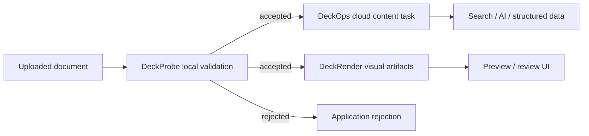

Use this page after choosing the result your application needs. Each workflow identifies the starting input, product sequence, final contract, and the point where document bytes leave the local machine.

| Application goal | Recommended path | Final result |
| --- | --- | --- |
| Gate an upload before cloud processing | DeckProbe → application policy | Accept, reject, or route |
| Build search, RAG, or document understanding | DeckOps Parse | Markdown or structured content |
| Add previews to a review interface | DeckRender | Images, PDF, or supported video |
| Personalize an existing presentation | DeckUse | Updated editable PPTX |
| Generate a presentation from application data | DeckHTML | PPTX or PNG with diagnostics |
| Validate, parse, and preview one upload | DeckProbe → DeckOps → DeckRender | Policy, content, and visual artifacts |

## Common agent scenarios

<CardGroup cols={2}>
  <Card title="Enterprise attachment intake" icon="inbox" iconType="solid" href="/common-workflows#upload-gate">
    Inspect an incoming Office, PDF, or iWork file locally, apply application policy, then send only accepted files to cloud processing.
  </Card>
  <Card title="Large-scale document inventory" icon="boxes-stacked" iconType="solid" href="/deckprobe/cli/automation-and-output">
    Run budgeted DeckProbe jobs in batches and store format, counts, structure, security signals, and asset facts before choosing downstream work.
  </Card>
  <Card title="Multimodal understanding and review" icon="eye" iconType="solid" href="/common-workflows#multimodal-review">
    Keep DeckOps content results and DeckRender visual artifacts as separate, traceable inputs for search, AI, preview, or human review.
  </Card>
  <Card title="Generated-document delivery check" icon="clipboard-check" iconType="solid" href="/common-workflows#delivery-check">
    Generate a deck with DeckHTML or update a PPTX with DeckUse, then render an artifact that the application or a reviewer can inspect before delivery.
  </Card>
</CardGroup>

These are composable application patterns, not an automatic end-to-end pipeline. Each product has its own input, result contract, execution boundary, and retry behavior.

## Gate document uploads before cloud processing

Start withAn untrusted PDF, Office, or modern iWork file received by your application.

<Steps>
  <Step title="Inspect locally">Run DeckProbe for identity, encryption, macro, structure, count, or asset targets.</Step>
  <Step title="Apply policy">Evaluate the Schema v2 evidence with your application's acceptance and routing rules.</Step>
  <Step title="Continue deliberately">Send only accepted files to DeckOps or DeckRender when downstream cloud processing is required.</Step>
</Steps>

Final resultAn evidence-backed accept, reject, or routing decision. Bytes stay local during DeckProbe and leave the machine only when your application passes them to a cloud product.

<Card title="Start with DeckProbe" href="/deckprobe/quick-start">
  Install the native CLI, inspect a known PDF, and verify the policy input contract.
</Card>

## Build search, RAG, or document understanding

Start withA supported PDF, PPTX, DOCX, Keynote file, or HTML URL.

Use DeckOps Parse when the application needs Markdown or source-format structure rather than pixels. Store the task ID with the derived result so failures, retries, and source-specific schemas remain observable.

Final resultMarkdown for indexing and model input, or a format-specific structured response for layouts, notes, elements, and semantic roles where implemented.

<Warning>
  The Parse facade and typed Parse tasks exist in the DeckOps repository source but are absent from the current `@deckops/sdk@0.7.3` npm artifact. Review [Parse Documents](/deckops/parse) and its availability notice before implementation.
</Warning>

## Add previews to review and approval interfaces

Start withA supported document, URL, or stdin stream.

Use DeckRender when the application needs page images, thumbnails, a PDF, or supported video output without managing the underlying DeckOps route and downloads. Most routes upload the source to DeckFlow cloud; local PDF passthrough and Pages/Numbers preview extraction are explicit exceptions.

Final resultWritten artifacts plus a <code>RenderResult</code> containing route, page count, output files, byte sizes, duration, and fidelity caveats.

<Card title="Start with DeckRender" href="/deckrender/quick-start">
  Create a known HTML input, render one PNG, and verify the file and JSON result.
</Card>

## Personalize an existing presentation

Start withAn editable <code>.pptx</code> that must remain the source of truth.

Use DeckUse to inspect selectors, replace or set existing text, and move supported shapes. Keep a persistent workspace when several changes belong to one output.

Final resultAnother editable PPTX created locally. The current release does not add or delete elements and does not edit DOCX, XLSX, or Keynote.

<Card title="Start with DeckUse" href="/deckuse/quick-start">
  Generate or supply a known PPTX, replace text, and verify the updated file.
</Card>

## Generate a deck from application data

Start withHTML or SVG authored from templates, application data, or generated content.

Use DeckHTML to map browser layout into editable PPTX elements where possible and raster fallback where necessary. Run locally when inputs must remain on the machine; choose cloud mode for cloud-only features such as font embedding.

Final resultPPTX or PNG plus diagnostics that identify native, vector, raster, ignored, and unsupported mappings.

<Card title="Start with DeckHTML" href="/deckhtml/quick-start">
  Prepare Chromium, create one slide, generate a PPTX, and inspect conversion decisions.
</Card>

## Review an updated or generated deck before delivery

Start with a PPTX produced by DeckUse or DeckHTML, then render the candidate with DeckRender. The render route may upload that PPTX to DeckFlow cloud.

<Steps>
  <Step title="Produce the candidate">Update an existing PPTX with DeckUse, or generate a new one from HTML with DeckHTML.</Step>
  <Step title="Create a visual artifact">Use DeckRender to write page images, a PDF, or another supported visual output.</Step>
  <Step title="Apply the delivery check">Let the application or a reviewer inspect the artifact before the PPTX is delivered.</Step>
</Steps>

Use the visual artifact and reported route caveats as inputs to the application's review or approval decision.

## Combine validation, content, and previews

For an upload pipeline that needs all three outcomes, keep the stages independent:

DeckProbe evidence, DeckOps structured results, and DeckRender artifacts are separate contracts. Persist and retry them independently; do not assume that one product automatically invokes another.

<CardGroup cols={2}>
  <Card title="Choose a product" href="/product-guide">Compare boundaries when only one result is required.</Card>
  <Card title="Run the minimum examples" href="/getting-started">See installation, invocation, and expected results for all five products.</Card>
</CardGroup>

<Card title="Prefer a copy-and-run recipe?" icon="flask" iconType="solid" href="/examples/overview" cta="Browse examples" arrow>
  Examples start from a known file or source snippet and include the command, expected output, and verification step.
</Card>
