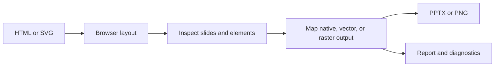

DeckHTML turns browser-rendered HTML or SVG into presentation artifacts. It uses the page's computed layout, then maps each element to a native, vector, raster, ignored, or unsupported presentation representation.

<CardGroup cols={2}>
  <Card title="Quickstart" href="/deckhtml/quick-start">
    Convert one HTML deck locally and inspect the output.
  </Card>
  <Card title="Author HTML" href="/deckhtml/reference/input-html">
    Structure slide hosts, sizes, identities, fonts, and assets for reliable conversion.
  </Card>
  <Card title="CLI" href="/deckhtml/cli/overview">
    Convert files, stdin, URLs, or ordered inputs from a terminal or CI job.
  </Card>
  <Card title="Node SDK" href="/deckhtml/sdk/overview">
    Control conversion, strictness, resources, and browser execution in code.
  </Card>
</CardGroup>

## What DeckHTML preserves

DeckHTML keeps text, images, tables, many shapes, supported SVG geometry, and MathML equations editable when a stable PPTX mapping exists. Canvas charts, complex SVG, layered backgrounds, and other unsupported effects may be rasterized to preserve appearance.

The conversion report makes this boundary visible per element. It should be part of automated quality checks when editability matters.

## Execution modes

- **Local** runs Playwright and the converter on your machine. It supports PPTX and PNG without cloud credentials.
- **Cloud** uploads the input and runs a DeckOps conversion task. Font embedding is available only in this mode.
- **Auto** selects cloud when credentials are configured and local otherwise.

## Product boundary

DeckHTML starts from HTML or SVG. Use [DeckProbe](/deckprobe/overview) to inspect existing documents, [DeckOps](/deckops/overview) for cloud parsing and document operations, and [DeckUse](/deckuse/overview) when changes must be written back to a supported Office source file.
