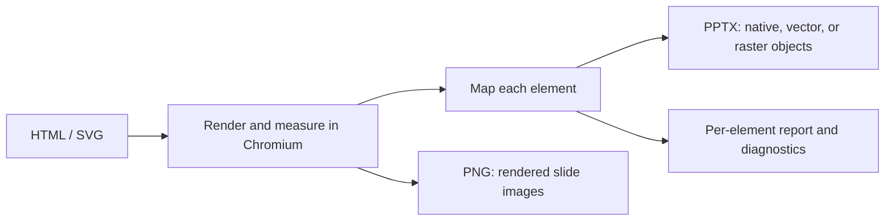

DeckHTML turns HTML templates, application data, or generated HTML into presentation files. Use it to create an editable PPTX for continued work in PowerPoint, or generate page PNGs for previews and downstream visual workflows. One source can contain several slides, and several ordered sources can be combined into one deck.

| | DeckHTML |
| --- | --- |
| Best for | HTML-native slide authoring and automated presentation generation |
| Inputs | Local HTML/SVG, ordered files, HTML from stdin, or one or more HTML URLs |
| Outputs | PPTX or PNG |
| Runs | Locally with Chromium, or in DeckFlow cloud |
| Interfaces | CLI and local Node.js API |
| Authentication | None for local mode; guest, login, or API key for cloud mode |

## When to use DeckHTML

- Generate presentations from templates, application data, or AI-authored HTML.
- Keep supported text, shapes, tables, images, SVG geometry, and equations editable in PowerPoint.
- Convert one multi-slide document or merge several ordered HTML/SVG files into one deck.
- Produce PNG previews from the same source.
- Consume per-element conversion diagnostics in your own automated checks.

## How conversion works



DeckHTML measures the rendered browser layout before rebuilding supported text, images, tables, shapes, SVG geometry, and equations as editable or vector PowerPoint objects. When no reliable PowerPoint mapping exists, it can preserve appearance with a raster fallback and record the decision in the conversion report.

<Note>
  HTML/CSS and PowerPoint use different layout and rendering models. Canvas, complex SVG, filters, layered effects, iframes, and unsupported CSS may be rasterized, omitted, or reported as unsupported. Use the report when editability is part of the delivery contract.
</Note>

## Execution modes

| Mode | Data boundary | Credentials | Notes |
| --- | --- | --- | --- |
| Local | Remains on your machine | None | Requires a compatible Chromium/Chrome/Edge executable |
| Cloud | Input is uploaded to DeckFlow | Guest, login, or API key | Font embedding is cloud-only |
| Auto | Selects cloud when credentials exist, otherwise local | Depends on selected mode | Be explicit in production workflows |

The Node.js API is local-only and returns buffers rather than writing files. The CLI can run locally or submit a cloud task. In `auto` mode, configured credentials select cloud execution; without credentials, `auto` stays local. Use an explicit mode in production so a credentials change cannot move processing across the data boundary.

## Choose an interface

| Interface | Use it when | Important boundary |
| --- | --- | --- |
| CLI | You need files on disk, shell automation, CI, stdin, or URL input | Supports local and cloud execution |
| Node.js API | Your application owns browser lifecycle, buffers, policies, or strict checks | Runs locally, accepts file paths or direct URLs, and does not write files |

The two interfaces handle URLs differently. The CLI fetches HTML text with Node.js before conversion, so it does not reuse browser cookies and does not automatically preserve the original base URL. The Node.js API navigates Chromium directly to a URL and can use a caller-provided browser context. See the [HTML input contract](/deckhtml/reference/input-html) before choosing a URL path.

## A first conversion

```bash
deckhtml deck.html -o deck.pptx --mode local --json
```

On success, the command exits with code `0`, writes the PPTX, and reports its resolved input/output paths and slide count. Follow the [Quickstart](/deckhtml/quick-start) to create a known input and verify the result.

## Continue

<CardGroup cols={2}>
  <Card title="Quickstart" href="/deckhtml/quick-start">Install, check Chromium, and build one PPTX.</Card>
  <Card title="Local mode" href="/deckhtml/guides/local-mode">Keep inputs on the current machine and use detailed mapping controls.</Card>
  <Card title="Cloud mode" href="/deckhtml/guides/cloud-mode">Upload inputs for managed conversion and matched font embedding.</Card>
  <Card title="Input contract" href="/deckhtml/reference/input-html">Author slides, sizes, identities, fonts, and resources.</Card>
  <Card title="Multi-page and batch input" href="/deckhtml/guides/multi-page-and-batch">Combine slide containers or ordered source files.</Card>
  <Card title="Element mapping" href="/deckhtml/guides/element-mapping">Understand editability and raster fallback.</Card>
  <Card title="Authentication" href="/deckhtml/authentication">Configure cloud guest, login, or API-key use.</Card>
</CardGroup>
