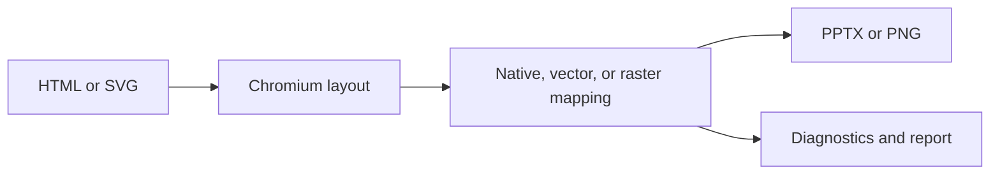

DeckHTML turns browser-laid-out HTML into PPTX or PNG. It maps text, images, tables, shapes, supported SVG, and equations to native or vector presentation elements where possible, and rasterizes content when visual fidelity is safer than editability.

| | DeckHTML |
| --- | --- |
| Best for | HTML-native slide authoring and automated presentation generation |
| Inputs | Local HTML or SVG, HTML from stdin, multiple ordered files, or an HTML URL |
| Outputs | PPTX or PNG |
| Runs | Locally with Chromium, or in Deckflow cloud |
| Interfaces | CLI and local Node.js API |
| Authentication | None for local mode; guest, login, or API key for cloud mode |



## When to use DeckHTML

- Generate presentations from templates, application data, or AI-authored HTML.
- Keep supported text, shapes, tables, images, SVG geometry, and equations editable in PowerPoint.
- Convert several local HTML/SVG files into ordered slides.
- Produce PNG previews from the same source.
- Inspect per-element conversion decisions in automated quality checks.

DeckHTML is not a promise of lossless browser-to-PowerPoint conversion. Canvas, complex SVG, filters, layered effects, iframes, and unsupported CSS may be rasterized, ignored, or reported as unsupported.

## Execution modes

| Mode | Data boundary | Credentials | Notes |
| --- | --- | --- | --- |
| Local | Remains on your machine | None | Requires a compatible Chromium/Chrome/Edge executable |
| Cloud | Input is uploaded to Deckflow | Guest, login, or API key | Font embedding is cloud-only |
| Auto | Selects cloud when credentials exist, otherwise local | Depends on selected mode | Be explicit in production workflows |

The Node.js API is local-only and returns buffers rather than writing files. The CLI can run locally or submit a DeckOps cloud task.

## A first conversion

```bash
deckhtml deck.html -o deck.pptx --mode local --json
```

On success, the command exits with code `0`, writes the PPTX, and reports its resolved input/output paths and slide count. Follow the [Quickstart](/deckhtml/quick-start) to create a known input and verify the result.

## Continue

<CardGroup cols={2}>
  <Card title="Quickstart" href="/deckhtml/quick-start">Install, check Chromium, and build one PPTX.</Card>
  <Card title="Input contract" href="/deckhtml/reference/input-html">Author slides, sizes, identities, fonts, and resources.</Card>
  <Card title="Element mapping" href="/deckhtml/guides/element-mapping">Understand editability and raster fallback.</Card>
  <Card title="Authentication" href="/deckhtml/authentication">Configure cloud guest, login, or API-key use.</Card>
</CardGroup>
