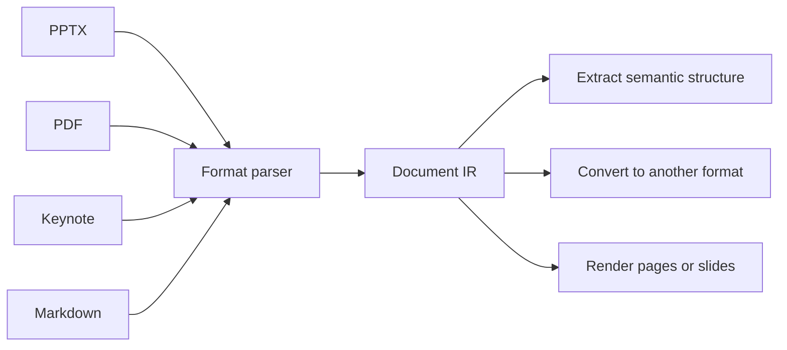

Document IR is the normalized result of DeckOps parsing. Each source-format parser translates its native package, object model, layout rules, and content into a shared schema.



The shared IR avoids a separate implementation for every source-to-destination pair. A PPTX parser and a Keynote parser can both produce Document IR; a PPTX writer, PDF writer, or renderer can then consume the same normalized representation.

## What the IR must preserve

The exact schema will be published with the implementation, but the IR is intended to preserve information needed by downstream operations:

- Document, section, page, slide, and sheet hierarchy.
- Canvas or page geometry, coordinate systems, ordering, and grouping.
- Semantic roles such as title, subtitle, body, caption, and footnote.
- Text runs, styles, paragraphs, lists, and language information.
- Images, shapes, tables, charts, formulas, and embedded resources.
- Speaker notes, comments, annotations, hyperlinks, and other non-canvas content.
- Format-specific behavior that can be represented consistently, such as transitions or workbook rules.

## Parse

Parse is the format-specific lowering stage:

```text
source bytes → format parser → Document IR
```

Parsing does not stop at a document-level inventory. It recovers page and element structure, semantic roles, content, styles, geometry, and relationships so downstream operations do not need to reopen the original format.

## Extract

Extract selects a useful semantic projection from the IR. For a presentation, an extracted page can distinguish:

```json
{
  "page": 3,
  "title": "Quarterly performance",
  "subtitle": "Revenue and margin",
  "charts": [],
  "speakerNotes": "Emphasize the regional mix shift.",
  "footnotes": ["Source: internal reporting"]
}
```

This is structurally different from plain-text extraction because page boundaries, roles, and typed objects remain explicit.

## Convert

Convert uses a destination writer or generator on top of the IR:

```text
PPTX → Document IR → PDF
Keynote → Document IR → PPTX
Markdown → Document IR → PPTX
```

The supported source and destination matrix will be documented from the implementation rather than inferred from the architecture.

## Document Information

Document Information is a document-level summary or developer-facing view derived from the parsed IR. It can present file identity, structure statistics, and content composition without replacing the IR itself.

<Warning>
  This page defines the architectural role of Document IR. Exact node types, field names, fidelity guarantees, and supported conversions remain provisional until they can be verified against DeckOps source and published contracts.
</Warning>
