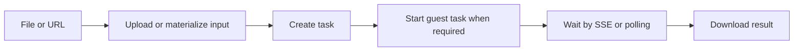

DeckOps provides cloud document capabilities for applications that need searchable text, format-specific structure, or a new file artifact. Send a supported file or URL to parse content, preserve useful document structure, convert formats, or run a broader document operation.

| | At a glance |
| --- | --- |
| Best for | Server-side parsing, extraction, conversion, and document workflows |
| Inputs | PDF, PPTX, DOCX, Keynote, supported conversion inputs, or an HTML URL |
| Results | Markdown, format-specific JSON, or files such as PDF, images, video, HTML, and PPTX |
| Runs | DeckFlow cloud |
| Interfaces | TypeScript SDK and CLI |
| Authentication | API key or user token; limited guest execution is available for low-level tasks |

## When to use DeckOps

- Parse PDF, PPTX, DOCX, or Keynote into Markdown for search, review, or AI pipelines.
- Retain format-specific structure such as slide geometry, notes, document elements, or PDF semantic roles.
- Convert supported documents into visual or editable artifacts.
- Run OCR, presentation inspection, compression, splitting, joining, font, image, or content tasks in the cloud.

DeckOps does not expose one cross-format public Document IR. The high-level `parse()` facade normalizes supported parse results to Markdown; low-level parse tasks preserve a different structured contract for each format. Read [Structured results](/deckops/structured-results) before storing or transforming those responses.

## How a cloud operation runs



## A first cloud task

```ts
import { createDeck } from '@deckops/sdk';

const deck = createDeck();
const task = await deck.convertHtmlToPng({ files: ['./sample.html'] });
await deck.tasks.start(task.id); // required for a guest task
const completed = await deck.tasks.wait(task.id);
const result = await deck.tasks.down(completed.id);

console.log(completed.id, completed.type, completed.status);
console.log(result);
```

This published-package path uploads the file, explicitly starts a guest task, waits for completion, and downloads the result. Follow the [Quickstart](/deckops/quick-start) for a complete runnable example.

<Note>
  SDK interfaces differ. The low-level task flow above is the most direct installable path; verify higher-level Parse helpers on [Parse Documents](/deckops/parse) before using them.
</Note>

## Execution and data boundary

Files processed by DeckOps are uploaded to DeckFlow cloud. Authenticated tasks start automatically. A guest-created low-level task must be started explicitly before waiting; the high-level parse facade does not perform that guest start for you.

<Warning>
  Use an API key or user token with `parse()` and `parseDetailed()`. If you need guest mode, use the low-level task API and call `tasks.start(task.id)` after creation. The Python SDK does not expose this guest-start method.
</Warning>

## Continue

<CardGroup cols={2}>
  <Card title="Quickstart" href="/deckops/quick-start">Run and verify a complete guest cloud task.</Card>
  <Card title="Authentication" href="/deckops/authentication">Choose guest, API-key, or user-token execution.</Card>
  <Card title="Task model" href="/deckops/task-model">Handle task creation, progress, retries, and downloads.</Card>
  <Card title="Capabilities" href="/deckops/operations">Find the task family that matches your workflow.</Card>
</CardGroup>
