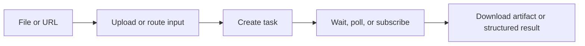

DeckOps is Deckflow's cloud document-processing runtime. It combines file upload, asynchronous task execution, structured parsing, extraction, conversion, and result delivery behind CLI and SDK interfaces.

<CardGroup cols={2}>
  <Card title="Quickstart" href="/deckops/quick-start">
    Parse a document and inspect the first result.
  </Card>
  <Card title="Task model" href="/deckops/task-model">
    Understand uploads, asynchronous execution, progress, and downloads.
  </Card>
  <Card title="Parse documents" href="/deckops/parse">
    Get Markdown or retain each format's structured parse result.
  </Card>
  <Card title="Operations" href="/deckops/operations">
    Explore conversion, PPTX, OCR, compression, and content tasks.
  </Card>
</CardGroup>

## Capability groups

| Area | What it provides |
| --- | --- |
| Parse | Parse PDF, PPTX, DOCX, and Keynote files, or extract readable content from a web URL |
| Extract | Inspect PPTX fonts, text shapes, layout data, images, and speaker notes; run image OCR |
| Convert | Convert presentation and document formats into PDF, images, video, HTML, or PPTX where supported |
| Operate | Compress files, split or join PPTX files, embed fonts, and resize or transcode images |
| Content workflows | Create, translate, or revamp document content through cloud tasks |

## Structured results, not one public IR

The current SDK exposes a different structured result contract for each parsed format. `deck.parse()` provides a normalized Markdown convenience result, while low-level parse tasks retain format-specific detail such as PPTX geometry, DOCX element types, PDF semantic roles, or Keynote slide structure.

Use [Structured Results](/deckops/structured-results) before building against a parse response.

## Available integrations

- TypeScript SDK for Node.js and browsers: `@deckops/sdk`
- Python SDK: `deckops-sdk`
- Go SDK: `github.com/deckops/deckops/sdks/go`
- Node.js CLI from npm and a native Go CLI from GitHub Releases

<Info>
  DeckOps executes document tasks in the cloud. Clients may run with a stable guest UUID, a user token, or an API key; server-side limits depend on the selected authentication mode.
</Info>
