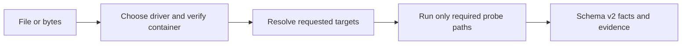

DeckProbe inspects predefined facts about a document without opening or rendering it, running macros, or launching Microsoft Office, Apple iWork, or another desktop suite. It returns named, verifiable properties such as format, page or slide count, encryption status, and asset inventory. It does not answer questions about document meaning or build a page-and-element content model.

The native CLI reads lazily from disk. The JavaScript SDK is designed to run the same Rust engine through WebAssembly in browsers and Node.js; see the publication status below before choosing that interface.

| Item | Current contract |
| --- | --- |
| Inputs | PDF; modern and legacy Word, Excel, and PowerPoint; modern Keynote, Numbers, and Pages |
| Result | Schema v2 JSON with target values, evidence, confidence, diagnostics, and measured I/O cost |
| Execution | Local native process or local WebAssembly; document bytes are not sent to Deckflow |
| Interfaces | Native CLI and npm CLI; ⚠ Browser, Worker, and Node.js npm release blocked |
| Authentication | None |

## Use DeckProbe for

- Verifying a claimed file type before accepting an upload.
- Reading counts, metadata, structural facts, security signals, or asset inventory.
- Routing a document to DeckOps or DeckRender based on evidence instead of extension alone.
- Enforcing predictable read, decompression, archive-entry, and time budgets.
- Producing stable JSON for policy engines, batch inventory, or agent tools.

<Tip>
  With telemetry disabled, the default report is deterministic. Enable telemetry only when the report needs elapsed-time measurements.
</Tip>

<Warning>
  The current `@deckflow/deckprobe@2.3.0` npm publication is missing the `dist/` and `wasm/` runtime files required by its JavaScript imports. The native CLI and npm-provided CLI work, but the Browser, Worker, and Node.js APIs do not work from this artifact.
</Warning>

## Choose an interface

<CardGroup cols={2}>
  <Card title="Native CLI" href="/deckprobe/quick-start">
    Best for large files, batch jobs, stdin, JSONL services, and strict process exit handling.
  </Card>
  <Card title="Browser SDK source contract" href="/deckprobe/browser-sdk">
    Review the implemented API and the current npm publication blocker.
  </Card>
  <Card title="Node.js source contract" href="/deckprobe/node-sdk">
    Review the implemented API and the current npm publication blocker.
  </Card>
  <Card title="Formats and targets" href="/deckprobe/formats-and-targets">
    Review document families, current exceptions, target discovery, and probe levels.
  </Card>
</CardGroup>

<Card title="Try Deck Playground ↗" href="https://deckflow.github.io/playground/">
  Inspect a document profile and DeckProbe facts in the browser. Page previews shown by the Playground are a combined Playground feature, not a DeckProbe report output.
</Card>

## Boundaries

DeckProbe returns document facts, not pixels or a complete content model. It does not run OCR, execute macros, follow external links, edit files, or return DeckOps parse results.

- Use [DeckRender](/deckrender/overview) for images, PDF, thumbnails, or video.
- Use [DeckOps](/deckops/overview) for page and element content, Markdown, extraction, or conversion.
- Use [DeckUse](/deckuse/overview) to update supported properties in an existing PPTX.

DeckProbe is open source. See the [DeckProbe repository](https://github.com/deckflow/deckprobe) for releases and implementation details.
