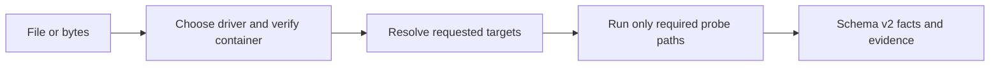

DeckProbe gives applications and agents a structured way to verify a document before accepting, routing, or processing it. It returns named, verifiable facts such as the actual format, page or slide count, encryption status, metadata, and asset inventory. Inspection runs locally and produces JSON that can be used directly in application logic.

| Item | At a glance |
| --- | --- |
| Inputs | PDF; modern and legacy Word, Excel, and PowerPoint; modern Keynote, Numbers, and Pages |
| Result | Schema v2 JSON with target values, evidence, confidence, diagnostics, and measured I/O cost |
| Execution | Local native process or local WebAssembly; document bytes are not sent to DeckFlow |
| Interfaces | Native and npm CLI, Browser and Worker SDK, Node.js API, Agent Skill, and local MCP Server |
| Authentication | None |

## Use DeckProbe for

- Preflight checks before an application accepts or stores an uploaded file.
- Batch inventory of document formats, counts, metadata, security signals, and embedded assets.
- Routing files to parsing or rendering workflows using verified facts instead of the extension alone.
- Policy checks that need stable JSON, evidence, confidence, and diagnostics.
- Local browser, server, CI, or agent workflows where document bytes must not be uploaded.

## How inspection works

DeckProbe selects the driver, validates the container, and runs only the probe paths required by the requested Targets. Callers can bound file reads, decompression, archive entries, and cooperative execution time.

## Choose an interface

<CardGroup cols={2}>
  <Card title="Native CLI" href="/deckprobe/quick-start">
    Best for large files, batch jobs, stdin, JSONL services, and strict process exit handling.
  </Card>
  <Card title="Browser and Worker SDK" href="/deckprobe/browser-sdk">
    Probe browser files locally on the main thread or move larger work into a Web Worker.
  </Card>
  <Card title="Node.js API" href="/deckprobe/node-sdk">
    Probe file paths or byte arrays from a Node.js 20+ application.
  </Card>
  <Card title="Agent integrations" href="/deckprobe/agent-integrations/overview">
    Use the CLI through an Agent Skill or expose typed tools through a local MCP server.
  </Card>
</CardGroup>

  <Card title="Try Deck Playground" icon="flask" iconType="solid" href="https://deckflow.github.io/playground/" cta="Open Playground ↗" arrow>
    Inspect a document profile and DeckProbe facts in the browser. Page previews shown by the Playground are a combined Playground feature, not a DeckProbe report output.
  </Card>

## Boundaries

DeckProbe returns document facts, not pixels or a complete content model. It does not run OCR, execute macros, follow external links, edit files, or return DeckOps parse results.

- Use [DeckRender](/deckrender/overview) for images, PDF, thumbnails, or video.
- Use [DeckOps](/deckops/overview) for page and element content, Markdown, extraction, or conversion.
- Use [DeckUse](/deckuse/overview) to update supported properties in an existing PPTX.

## Source and support

DeckProbe is fully open source. Visit the [DeckProbe repository](https://github.com/deckflow/deckprobe) to inspect the implementation, follow releases, or report an issue.
