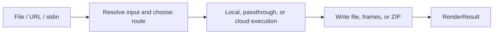

DeckRender is a visual artifact router for documents. It accepts one local file, HTTP(S) URL, or stdin stream, selects an implemented source-to-output route, executes it, and writes a file, numbered frames, or a ZIP archive.

| Item | Current contract |
| --- | --- |
| Inputs | PowerPoint, PDF, Keynote, Word, HTML, Markdown, Pages, and Numbers on supported routes |
| Outputs | PNG, JPEG, or WebP images; PDF; MP4 video |
| Interfaces | `deckrender` CLI and `@deckflow/deckrender` Node.js API |
| Execution | Mostly Deckflow cloud tasks, plus local PDF passthrough and iWork preview extraction |
| Authentication | Optional guest mode, browser login, token, or API key |

## Use DeckRender for

- Page or slide previews and thumbnails.
- PNG, JPEG, or WebP frames for review, search, or visual pipelines.
- PDF delivery from supported presentation, document, or HTML inputs.
- MP4 slideshow output from PowerPoint, or from HTML through a PPTX route.
- A stable artifact and result contract without managing DeckOps task chains directly.

DeckRender does not parse text or document elements, return Document IR, or edit source content. Its `RenderPlan` describes execution only.

## Data and execution boundary

Most formats are uploaded to Deckflow cloud tasks. A local PDF-to-PDF request is passed through without upload. Pages and Numbers are handled locally by extracting the embedded first-page JPEG preview; this is not a full iWork render.

An HTTP(S) URL is fetched by the local Node.js process. HTML receives a base URL for relative assets and is then uploaded as source content. DeckRender does not capture the current state, cookies, or authenticated session of the user's browser.

<Warning>
  HTML-to-PDF and HTML-to-video first rebuild HTML as PPTX. The result follows a slide model rather than native print layout or a recording of a live page.
</Warning>

## Start here

<CardGroup cols={2}>
  <Card title="Quickstart" href="/deckrender/quick-start">
    Create a minimal HTML input, render one PNG, and verify the result.
  </Card>
  <Card title="Supported formats" href="/deckrender/formats">
    Check implemented routes, output encodings, and fidelity caveats.
  </Card>
  <Card title="Authentication" href="/deckrender/authentication">
    Choose guest mode, browser login, an API key, or CI environment variables.
  </Card>
  <Card title="CLI" href="/deckrender/cli/overview">
    Control input forms, output naming, page selection, sizing, and profiles.
  </Card>
  <Card title="Node.js SDK" href="/deckrender/sdk/node">
    Render programmatically and receive progress, warnings, and `RenderResult`.
  </Card>
  <Card title="Result contract" href="/deckrender/reference/result-contract">
    Consume routes, page counts, written artifacts, caveats, and typed errors.
  </Card>
</CardGroup>

Use [DeckProbe](/deckprobe/overview) for facts without rendering, [DeckOps](/deckops/overview) for structured content and broader cloud operations, or [DeckUse](/deckuse/overview) to change an existing PPTX.

DeckRender is open source. See the [DeckRender repository](https://github.com/deckflow/deckrender).
