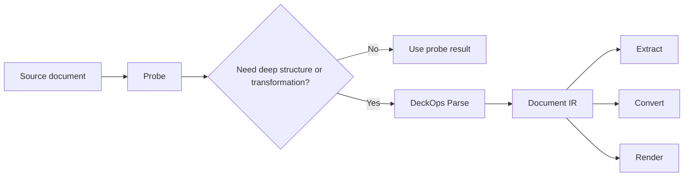

# DeckProbe vs. DeckOps

DeckProbe is a focused inspection engine. DeckOps is the full document runtime and includes probing and rendering alongside Parse, Extract, and Convert.

| Dimension | DeckProbe | DeckOps |
| --- | --- | --- |
| Primary purpose | Fast, targeted document inspection | End-to-end document understanding and transformation |
| Execution | Native Rust locally or Browser JS SDK | Cloud execution through an SDK surface |
| Typical question | What is this file, what does it contain, and how much? | How can this document become a shared IR, structured extraction, or another format? |
| Granularity | Document-level targets with evidence and measured cost | Document, page or slide, and element-level IR nodes |
| Parsing model | Runs only the probe paths required by requested targets | Format-specific parsers lower documents directly into one Document IR |
| Extraction | Signals, counts, names, dimensions, and bounded format facts | Semantic structures such as title, subtitle, chart, speaker notes, and footnotes |
| Conversion | Not a conversion engine | Converts through the shared IR, subject to the supported format matrix |
| Rendering | No | Included in the combined runtime |
| Source mutation | No | No source-aware write-back; use DeckUse for manipulation |

## Choose DeckProbe

Use DeckProbe when the application needs local or in-browser inspection, deterministic evidence, explicit confidence, and bounded I/O without uploading document bytes from the browser SDK.

Try the [Deck Playground](https://deckflow.github.io/playground/) for a visual view of document-level profile information, preview, and possible next actions.

## Choose DeckOps

Use DeckOps when a cloud workflow needs one or more of the following:

- A unified Document IR across heterogeneous formats.
- Semantic, page-aware extraction rather than plain text.
- Format conversion through shared parsers and writers.
- Rendering combined with probing and document operations.

## Runtime flow

<Note>
  DeckProbe's `deep` level still returns target evidence. It does not produce the DeckOps Document IR; “deep” only expands the probe paths and budgets available to the target planner.
</Note>
