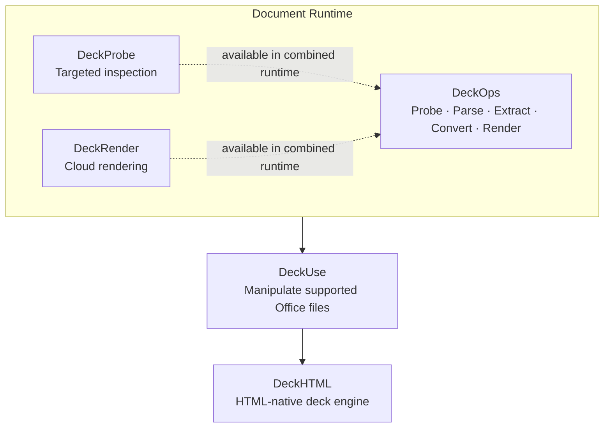

# Runtime architecture

Deckflow organizes document capabilities into a core runtime, a source manipulation layer, and a specialized HTML-native deck engine.

The vertical layout describes product layers, not a requirement that every request call each product in sequence.

## Document Runtime

- **DeckProbe** provides standalone local and browser inspection. It is the smallest runtime when only targeted facts are needed.
- **DeckRender** exposes an SDK for cloud rendering when a workflow needs visual page or slide output.
- **DeckOps** is the broad cloud runtime. It combines Probe and Render with Parse, Extract, and Convert around a unified Document IR.

## Manipulate Layer

**DeckUse** operates on supported Office source files. It is for source-aware element modification and deletion where the Office file remains the editable artifact.

## HTML-native Engine

**DeckHTML** is a specialized engine for the growing pattern of authoring decks in HTML. It turns HTML layouts into presentation artifacts through local and cloud execution paths.

## Capability map

| Capability | Primary product |
| --- | --- |
| Probe | DeckProbe; also available through DeckOps |
| Parse to Document IR | DeckOps |
| Extract semantic page structure | DeckOps |
| Convert document formats | DeckOps |
| Render | DeckRender; also available through DeckOps |
| Manipulate supported Office files | DeckUse |
| Build decks from HTML | DeckHTML |
