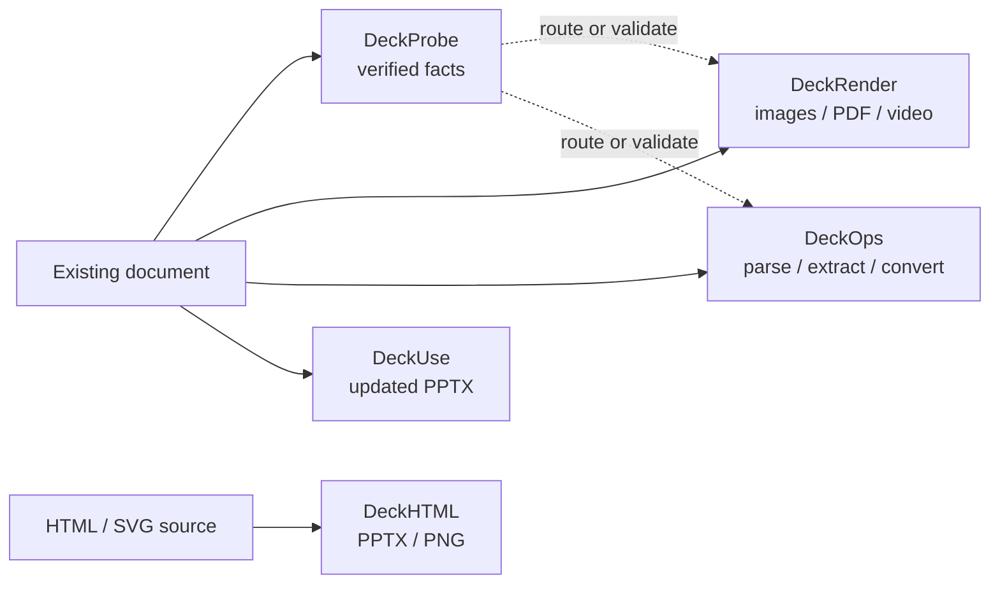

  Document runtime for developers
  <h2 className="deckflow-hero-title">One document stack, five focused outcomes</h2>
  
Inspect a file without opening it, render dependable previews, run cloud document operations, update an existing PPTX, or generate a new deck from HTML.

  

    Local-first inspection
    Cloud document tasks
    Editable PPTX workflows
  

<Card title="Try Deck Playground — no setup required" icon="flask" iconType="solid" href="https://deckflow.github.io/playground/" cta="Open Playground ↗" arrow>
  Choose a supported document in the browser to review DeckProbe facts, DeckRender previews, and DeckOps parse results before installing a CLI or SDK.
</Card>

## Start with the outcome

<CardGroup cols={2}>
  <Card title="Inspect before opening" icon="magnifying-glass" iconType="solid" color="#14b8a6" href="/deckprobe/overview" cta="Explore DeckProbe" arrow>
    <strong>DeckProbe</strong> reads document identity, metadata, structure, security signals, and asset facts locally without launching Office or iWork.
  </Card>
  <Card title="Render a document" icon="images" iconType="solid" color="#3b82f6" href="/deckrender/overview" cta="Explore DeckRender" arrow>
    <strong>DeckRender</strong> routes supported files to images, PDF, or video and writes predictable artifacts.
  </Card>
  <Card title="Run document operations" icon="cube" iconType="solid" color="#8b5cf6" href="/deckops/overview" cta="Explore DeckOps" arrow>
    <strong>DeckOps</strong> provides cloud parsing, extraction, conversion, generation, and asynchronous task execution.
  </Card>
  <Card title="Update an existing PPTX" icon="pen-to-square" iconType="solid" color="#f59e0b" href="/deckuse/overview" cta="Explore DeckUse" arrow>
    <strong>DeckUse</strong> replaces selected text and moves supported shapes while producing another editable PPTX.
  </Card>
  <Card title="Author a deck in HTML" icon="code" iconType="solid" color="#ec4899" href="/deckhtml/overview" cta="Explore DeckHTML" arrow>
    <strong>DeckHTML</strong> maps browser layout to PPTX or PNG and reports which elements stay editable or fall back to pixels.
  </Card>
</CardGroup>

## How the products fit together

DeckProbe and DeckUse execute locally. DeckRender uses local, passthrough, and Deckflow cloud routes. DeckOps executes document tasks in the cloud. DeckHTML supports local browser-based conversion and a cloud mode.

## Compare the execution boundary

| Goal | Product | Primary interface | Authentication |
| --- | --- | --- | --- |
| Verify format, counts, metadata, structure, or risk signals | [DeckProbe](/deckprobe/overview) | Native or npm CLI; JavaScript SDK pending package correction | Not required; processing stays local |
| Produce page images, PDF, thumbnails, or video | [DeckRender](/deckrender/overview) | CLI or Node.js SDK | Optional for cloud routes; guest mode is available |
| Parse, extract, convert, generate, or orchestrate cloud tasks | [DeckOps](/deckops/overview) | Published TypeScript task SDK or CLI; source Python/Go implementations | Credentials for high-level Parse; limited guest low-level tasks |
| Replace text or move supported shapes in an existing PPTX | [DeckUse](/deckuse/overview) | CLI; Node.js package currently blocked | Not required; processing stays local |
| Generate PPTX or PNG from HTML or SVG | [DeckHTML](/deckhtml/overview) | CLI or Node.js SDK | Not required locally; optional for cloud mode |

<Note>
  Supported formats and operations differ by product. A file being recognized by one product does not mean every other product can process it. Use each product's supported-format or command reference as the version-specific contract.
</Note>

## Start building

<Steps>
  <Step title="Choose the final artifact">
    Decide whether the workflow needs facts, pixels, structured content, an updated source file, or a deck generated from HTML.
  </Step>
  <Step title="Run one complete example">
    Open [Getting Started](/getting-started) for the shortest install, invocation, and result path for all five products.
  </Step>
  <Step title="Map the application workflow">
    Use [Common Workflows](/common-workflows) when validation, parsing, rendering, or generation must be combined into one application path.
  </Step>
  <Step title="Adapt a runnable example">
    Open [Examples](/examples/overview) for complete, task-oriented recipes with known input and expected output.
  </Step>
</Steps>

<Columns cols={2}>
  <Card title="Not sure which product fits?" icon="route" iconType="solid" href="/product-guide" horizontal>
    Compare inputs, outputs, execution locations, and product boundaries.
  </Card>
  <Card title="Ready to copy code?" icon="flask" iconType="solid" href="/examples/overview" horizontal>
    Start with a self-contained example instead of assembling a path from reference pages.
  </Card>
</Columns>
