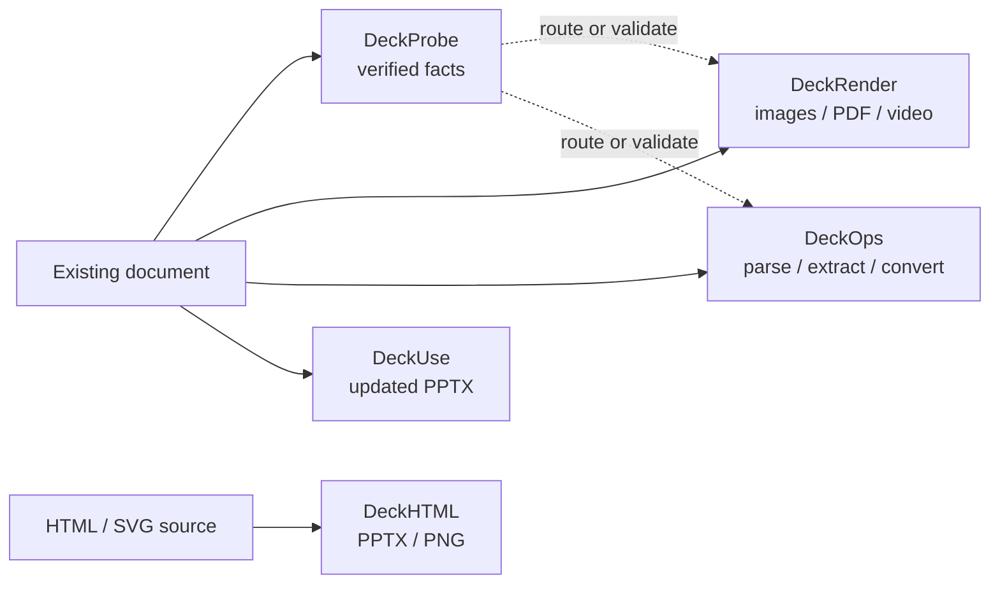

Deckflow is a document runtime for applications and AI agents. Its five focused products share a document-processing ecosystem, but each one has a different final result: verified facts, visual artifacts, structured cloud results, an updated PPTX, or a deck generated from HTML.

<CardGroup cols={2}>
  <Card title="Inspect before opening" icon="magnifying-glass" href="/deckprobe/overview">
    **DeckProbe** reads document identity, metadata, structure, security signals, and asset facts locally without launching Office or iWork.
  </Card>
  <Card title="Render a document" icon="images" href="/deckrender/overview">
    **DeckRender** routes supported files to images, PDF, or video and writes predictable artifacts.
  </Card>
  <Card title="Run document operations" icon="cube" href="/deckops/overview">
    **DeckOps** provides cloud parsing, extraction, conversion, generation, and asynchronous task execution.
  </Card>
  <Card title="Update an existing PPTX" icon="pen-to-square" href="/deckuse/overview">
    **DeckUse** replaces selected text and moves supported shapes while producing another editable PPTX.
  </Card>
  <Card title="Author a deck in HTML" icon="code" href="/deckhtml/overview">
    **DeckHTML** maps browser layout to PPTX or PNG and reports which elements stay editable or fall back to pixels.
  </Card>
</CardGroup>

## How the products fit together

DeckProbe and DeckUse execute locally. DeckRender uses local, passthrough, and Deckflow cloud routes. DeckOps executes document tasks in the cloud. DeckHTML supports local browser-based conversion and a cloud mode.

## Choose by the result you need

| Goal | Product | Primary interface | Authentication |
| --- | --- | --- | --- |
| Verify format, counts, metadata, structure, or risk signals | [DeckProbe](/deckprobe/overview) | Native or npm CLI; JavaScript SDK pending package correction | Not required; processing stays local |
| Produce page images, PDF, thumbnails, or video | [DeckRender](/deckrender/overview) | CLI or Node.js SDK | Optional for cloud routes; guest mode is available |
| Parse, extract, convert, generate, or orchestrate cloud tasks | [DeckOps](/deckops/overview) | Published TypeScript task SDK or CLI; source Python/Go implementations | Credentials for high-level Parse; limited guest low-level tasks |
| Replace text or move supported shapes in an existing PPTX | [DeckUse](/deckuse/overview) | CLI; Node.js package currently blocked | Not required; processing stays local |
| Generate PPTX or PNG from HTML or SVG | [DeckHTML](/deckhtml/overview) | CLI or Node.js SDK | Not required locally; optional for cloud mode |

<Note>
  Supported formats and operations differ by product. A file being recognized by one product does not mean every other product can process it. Use each product's supported-format or command reference as the version-specific contract.
</Note>

## Start building

<Steps>
  <Step title="Choose the final artifact">
    Decide whether the workflow needs facts, pixels, structured content, an updated source file, or a deck generated from HTML.
  </Step>
  <Step title="Run one complete example">
    Open [Getting Started](/getting-started) for the shortest install, invocation, and result path for all five products.
  </Step>
  <Step title="Map the application workflow">
    Use [Common Workflows](/common-workflows) when validation, parsing, rendering, or generation must be combined into one application path.
  </Step>
  <Step title="Move to the product guide">
    Follow the product's Quickstart, then use its CLI, SDK, guides, and reference pages for production integration.
  </Step>
</Steps>

If two products appear to overlap, use [Choose a Product](/product-guide) before implementing the workflow.
