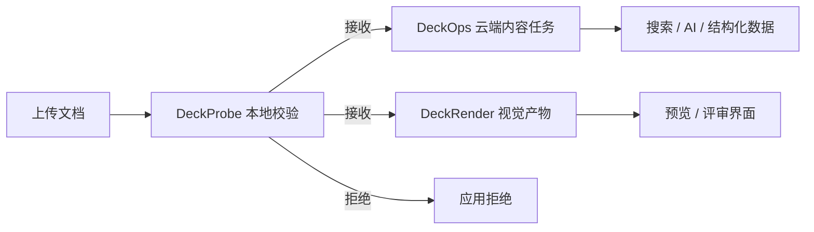

确定应用需要的结果后，再使用本页选择实际工作流。每条路径都会说明起始输入、产品顺序、最终契约，以及文档字节在何处离开本机。

| 应用目标 | 推荐路径 | 最终结果 |
| --- | --- | --- |
| 在云端处理前控制上传入口 | DeckProbe → 应用策略 | 接收、拒绝或路由 |
| 构建搜索、RAG 或文档理解 | DeckOps Parse | Markdown 或结构化内容 |
| 为评审界面加入预览 | DeckRender | 图片、PDF 或受支持的视频 |
| 个性化修改现有演示文稿 | DeckUse | 修改后仍可编辑的 PPTX |
| 从应用数据生成演示文稿 | DeckHTML | PPTX 或 PNG，以及诊断信息 |
| 校验、解析并预览同一上传文件 | DeckProbe → DeckOps → DeckRender | 策略、内容和视觉产物 |

## 常见 Agent 场景

<CardGroup cols={2}>
  <Card title="企业附件入口" icon="inbox" iconType="solid" href="/zh/common-workflows#upload-gate">
    在本地检查收到的 Office、PDF 或 iWork 文件，执行应用策略，再把通过校验的文件交给云端处理。
  </Card>
  <Card title="大规模文档盘点" icon="boxes-stacked" iconType="solid" href="/zh/deckprobe/cli/automation-and-output">
    批量运行带资源预算的 DeckProbe 任务，保存格式、数量、结构、安全信号和资源事实，再决定后续处理方式。
  </Card>
  <Card title="多模态理解与评审" icon="eye" iconType="solid" href="/zh/common-workflows#multimodal-review">
    把 DeckOps 内容结果和 DeckRender 视觉产物作为相互独立、可追踪的输入，用于搜索、AI、预览或人工评审。
  </Card>
  <Card title="生成文档的交付检查" icon="clipboard-check" iconType="solid" href="/zh/common-workflows#delivery-check">
    使用 DeckHTML 生成 Deck，或使用 DeckUse 更新 PPTX，再渲染视觉产物，交由应用或评审人员在交付前检查。
  </Card>
</CardGroup>

这些是可以组合的应用模式，不是一条自动执行的端到端流水线。每个产品都有独立的输入、结果契约、执行边界和重试行为。

## 在云端处理前校验文档上传

起始输入应用接收到的不可信 PDF、Office 或现代 iWork 文件。

<Steps>
  <Step title="本地检查">运行 DeckProbe，获取身份、加密、宏、结构、数量或资源 Target。</Step>
  <Step title="执行策略">根据 Schema v2 证据应用接收和路由规则。</Step>
  <Step title="明确进入下一步">只有需要云端处理时，才把通过校验的文件交给 DeckOps 或 DeckRender。</Step>
</Steps>

最终结果基于证据的接收、拒绝或路由判断。DeckProbe 阶段字节留在本地，只有应用把文件交给云端产品时才会离开本机。

<Card title="从 DeckProbe 开始" href="/zh/deckprobe/quick-start">
  安装原生 CLI，检查一个已知 PDF，并验证策略输入契约。
</Card>

## 构建搜索、RAG 或文档理解

起始输入受支持的 PDF、PPTX、DOCX、Keynote 文件或 HTML URL。

应用需要 Markdown 或源格式结构而不是像素时，使用 DeckOps Parse。把 Task ID 与派生结果一起保存，让失败、重试和格式专属 Schema 保持可观测。

最终结果用于索引和模型输入的 Markdown，或在已实现范围内包含布局、备注、元素和语义角色的格式专属结构化响应。

<Warning>
  Parse Facade 和类型化 Parse 任务已存在于 DeckOps 仓库源码，但当前 `@deckops/sdk@0.7.3` npm 产物没有包含。实现前请先查看[解析文档](/zh/deckops/parse)及其可用性说明。
</Warning>

## 为评审和审批界面增加预览

起始输入受支持的文档、URL 或 stdin 流。

应用需要页面图片、缩略图、PDF 或受支持的视频，又不想管理底层 DeckOps 路由和下载时，使用 DeckRender。多数路径会把源文件上传到 DeckFlow 云端；本地 PDF 透传和 Pages/Numbers 预览提取是明确例外。

最终结果写入的产物，以及包含路由、页数、输出文件、字节数、耗时和保真限制的 <code>RenderResult</code>。

<Card title="从 DeckRender 开始" href="/zh/deckrender/quick-start">
  创建已知 HTML 输入，渲染一张 PNG，并验证文件和 JSON 结果。
</Card>

## 个性化现有演示文稿

起始输入必须继续作为事实源的可编辑 <code>.pptx</code>。

使用 DeckUse 检查 Selector、替换或设置现有文本，并移动受支持的 Shape。一次输出包含多项修改时，使用持久化 Workspace。

最终结果在本地生成的另一个可编辑 PPTX。当前版本不能新增或删除元素，也不能编辑 DOCX、XLSX 或 Keynote。

<Card title="从 DeckUse 开始" href="/zh/deckuse/quick-start">
  生成或提供一个已知 PPTX，替换文本并验证修改后的文件。
</Card>

## 从应用数据生成 Deck

起始输入根据模板、应用数据或生成内容编写的 HTML 或 SVG。

使用 DeckHTML 把浏览器布局尽可能映射为可编辑 PPTX 元素，并在必要时回退为栅格图像。输入必须留在本机时使用本地模式；需要字体嵌入等云端专属能力时选择云端模式。

最终结果PPTX 或 PNG，以及标识原生、矢量、栅格、忽略和不支持映射的诊断信息。

<Card title="从 DeckHTML 开始" href="/zh/deckhtml/quick-start">
  准备 Chromium、创建一页幻灯片、生成 PPTX，并检查转换决策。
</Card>

## 在交付前检查修改或生成的 Deck

从 DeckUse 或 DeckHTML 生成的 PPTX 开始，再使用 DeckRender 渲染候选文件。DeckRender 路线可能会把该 PPTX 上传到 DeckFlow 云端。

<Steps>
  <Step title="生成候选文件">使用 DeckUse 更新现有 PPTX，或使用 DeckHTML 从 HTML 生成新 Deck。</Step>
  <Step title="生成视觉产物">使用 DeckRender 写出页面图片、PDF 或其他受支持的视觉输出。</Step>
  <Step title="执行交付检查">由应用或评审人员检查视觉产物，再决定是否交付 PPTX。</Step>
</Steps>

应用可以把视觉产物和返回的路线限制作为评审或审批判断的输入。

## 组合校验、内容和预览

上传工作流同时需要三类结果时，让各阶段保持独立：

DeckProbe 证据、DeckOps 结构化结果和 DeckRender 产物是三个独立契约。请分别保存和重试，不要假设一个产品会自动调用另一个产品。

<CardGroup cols={2}>
  <Card title="选择产品" href="/zh/product-guide">只需要一种结果时比较产品边界。</Card>
  <Card title="运行最小示例" href="/zh/getting-started">查看五个产品的安装、调用和预期结果。</Card>
</CardGroup>

<Card title="希望直接复制运行？" icon="flask" iconType="solid" href="/zh/examples/overview" cta="浏览示例" arrow>
  示例从一份已知文件或源代码开始，并提供命令、预期输出和验证步骤。
</Card>
