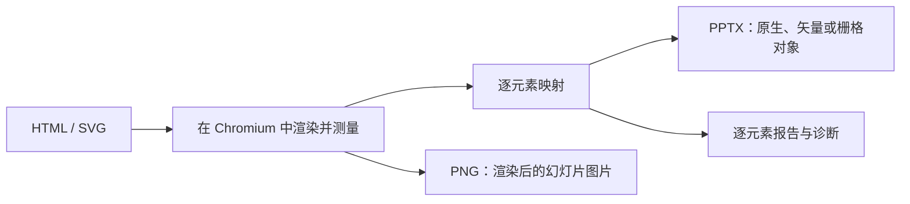

DeckHTML 把 HTML 模板、应用数据或生成式 HTML 转成演示文稿文件。可以生成一份仍能在 PowerPoint 中继续处理的可编辑 PPTX，也可以生成用于预览和后续视觉流程的页面 PNG。一份源文件可以包含多张幻灯片，多份有序源文件也可以合并成一个 Deck。

| | DeckHTML |
| --- | --- |
| 适用场景 | HTML 原生幻灯片创作和自动生成演示文稿 |
| 输入 | 本地 HTML/SVG、有序文件、标准输入中的 HTML，或一个或多个 HTML URL |
| 输出 | PPTX 或 PNG |
| 执行位置 | 本地 Chromium，或 DeckFlow 云端 |
| 接入方式 | CLI 和本地 Node.js API |
| 认证 | 本地模式不需要；云端支持游客、登录或 API Key |

## 适合使用 DeckHTML 的场景

- 从模板、应用数据或 AI 生成的 HTML 创建演示文稿。
- 在 PowerPoint 中保留受支持文字、形状、表格、图片、SVG 几何和公式的可编辑性。
- 把一份多页文档或多个有序 HTML/SVG 文件合并为一份演示文稿。
- 从同一份输入生成 PNG 预览。
- 在自己的自动化检查中使用逐元素转换诊断。

## 转换过程



DeckHTML 会先测量浏览器实际渲染后的布局，再把支持的文字、图片、表格、形状、SVG 几何和公式重建为可编辑或矢量的 PowerPoint 对象。没有可靠映射时，可以使用栅格图保留外观，并在转换报告中记录这一决定。

<Note>
  HTML/CSS 与 PowerPoint 使用不同的布局和渲染模型。Canvas、复杂 SVG、滤镜、分层效果、iframe 和不支持的 CSS 可能被栅格化、省略，或报告为不支持。如果交付要求包含可编辑性，请务必检查转换报告。
</Note>

## 执行模式

| 模式 | 数据边界 | 凭证 | 说明 |
| --- | --- | --- | --- |
| 本地 | 数据留在本机 | 无 | 需要兼容的 Chromium、Chrome 或 Edge 可执行文件 |
| 云端 | 输入上传到 DeckFlow | 游客、登录或 API Key | 字体嵌入仅云端可用 |
| 自动 | 有凭证时使用云端，否则本地 | 取决于最终模式 | 生产工作流建议显式指定 |

Node.js API 只在本地运行并返回 Buffer，不会写文件。CLI 既可在本地运行，也可提交云端任务。`auto` 模式在已配置凭证时选择云端，否则留在本地。生产环境建议显式指定模式，避免凭证变化意外改变数据边界。

## 选择接入方式

| 接口 | 适用情况 | 关键边界 |
| --- | --- | --- |
| CLI | 需要落盘文件、Shell 自动化、CI、标准输入或 URL 输入 | 同时支持本地与云端执行 |
| Node.js API | 应用需要管理浏览器、Buffer、资源策略或严格校验 | 在本地执行，可接收文件路径或直接 URL，不会自动写文件 |

两种接口对 URL 的处理不同。CLI 先通过 Node.js 获取 HTML 文本再转换，不会复用浏览器 Cookie，也不会自动保留原始 Base URL；Node.js API 则让 Chromium 直接导航到 URL，并可使用调用方提供的浏览器上下文。选择 URL 接入方式前，请先阅读 [HTML 输入约定](/zh/deckhtml/reference/input-html)。

## 第一次转换

```bash
deckhtml deck.html -o deck.pptx --mode local --json
```

成功时命令以代码 `0` 退出，写入 PPTX，并返回解析后的输入/输出路径和幻灯片数量。请按[快速开始](/zh/deckhtml/quick-start)创建已知输入并验证结果。

## 继续阅读

<CardGroup cols={2}>
  <Card title="快速开始" href="/zh/deckhtml/quick-start">安装、检查 Chromium 并生成一个 PPTX。</Card>
  <Card title="本地模式" href="/zh/deckhtml/guides/local-mode">让输入保留在当前机器，并使用详细的元素映射控制。</Card>
  <Card title="云端模式" href="/zh/deckhtml/guides/cloud-mode">上传输入进行托管转换，并可嵌入匹配字体。</Card>
  <Card title="输入契约" href="/zh/deckhtml/reference/input-html">定义幻灯片、尺寸、标识、字体和资源。</Card>
  <Card title="多页与批量输入" href="/zh/deckhtml/guides/multi-page-and-batch">组合多页容器或有序源文件。</Card>
  <Card title="元素映射" href="/zh/deckhtml/guides/element-mapping">了解可编辑性和栅格回退。</Card>
  <Card title="认证" href="/zh/deckhtml/authentication">配置云端游客、登录或 API Key。</Card>
</CardGroup>

## 源码与云端访问

- [DeckHTML 项目仓库](https://github.com/deckflow/deckhtml)包含本地转换引擎、CLI 和 Node.js API，可用于查看本地执行行为、跟踪版本发布或提交 Issue。
- 云端模式通过 DeckFlow 提供。请阅读[认证](/zh/deckhtml/authentication)，了解游客试用和认证后的云端访问方式。
