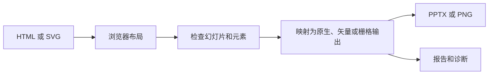

DeckHTML 将浏览器渲染后的 HTML 或 SVG 转换为演示文稿产物。它读取页面的计算布局，再把每个元素映射为原生、矢量、栅格、忽略或不支持的演示文稿表示。

<CardGroup cols={2}>
  <Card title="快速开始" href="/zh/deckhtml/quick-start">
    在本地转换第一个 HTML Deck 并检查输出。
  </Card>
  <Card title="编写 HTML" href="/zh/deckhtml/reference/input-html">
    按可靠转换需要组织 Slide、尺寸、元素标识、字体和资源。
  </Card>
  <Card title="CLI" href="/zh/deckhtml/cli/overview">
    在终端或 CI 中转换文件、stdin、URL 或有序输入。
  </Card>
  <Card title="Node SDK" href="/zh/deckhtml/sdk/overview">
    在代码中控制转换、严格模式、资源和浏览器执行。
  </Card>
</CardGroup>

## DeckHTML 会保留什么

存在稳定 PPTX 映射时，DeckHTML 会尽量让文本、图片、表格、常见形状、支持的 SVG 几何和 MathML 公式保持可编辑。Canvas 图表、复杂 SVG、分层背景等不支持效果可能会被栅格化以保留视觉表现。

转换报告会逐元素呈现这条边界。对可编辑性有要求时，应把报告检查纳入自动化流程。

## 执行模式

- **Local**：在当前机器运行 Playwright 和转换器，无需云端凭证，支持 PPTX 和 PNG。
- **Cloud**：上传输入并执行 DeckOps 转换任务，字体嵌入只在此模式提供。
- **Auto**：已配置凭证时选择 Cloud，否则选择 Local。

## 产品边界

DeckHTML 从 HTML 或 SVG 出发。检查已有文档使用 [DeckProbe](/zh/deckprobe/overview)，云端解析和文档操作使用 [DeckOps](/zh/deckops/overview)，需要把修改写回支持的 Office 源文件时使用 [DeckUse](/zh/deckuse/overview)。
