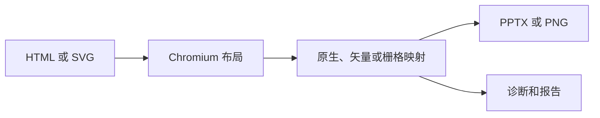

DeckHTML 把经过浏览器布局的 HTML 转换为 PPTX 或 PNG。它会尽可能把文字、图片、表格、形状、受支持的 SVG 和公式映射为原生或矢量演示文稿元素；当视觉一致性比可编辑性更可靠时，则回退为栅格图像。

| | DeckHTML |
| --- | --- |
| 适用场景 | HTML 原生幻灯片创作和自动生成演示文稿 |
| 输入 | 本地 HTML 或 SVG、stdin 中的 HTML、多个有序文件，或 HTML URL |
| 输出 | PPTX 或 PNG |
| 执行位置 | 本地 Chromium，或 DeckFlow 云端 |
| 接入方式 | CLI 和本地 Node.js API |
| 认证 | 本地模式不需要；云端支持游客、登录或 API Key |



## 适合使用 DeckHTML 的场景

- 从模板、应用数据或 AI 生成的 HTML 创建演示文稿。
- 在 PowerPoint 中保留受支持文字、形状、表格、图片、SVG 几何和公式的可编辑性。
- 把多个本地 HTML/SVG 文件按顺序合并为幻灯片。
- 从同一份输入生成 PNG 预览。
- 在自己的自动化检查中使用逐元素转换诊断。

DeckHTML 不承诺浏览器到 PowerPoint 的无损转换。Canvas、复杂 SVG、滤镜、分层效果、iframe 和不支持的 CSS 可能被栅格化、忽略或标记为不支持。

## 执行模式

| 模式 | 数据边界 | 凭证 | 说明 |
| --- | --- | --- | --- |
| 本地 | 数据留在本机 | 无 | 需要兼容的 Chromium、Chrome 或 Edge 可执行文件 |
| 云端 | 输入上传到 DeckFlow | 游客、登录或 API Key | 字体嵌入仅云端可用 |
| 自动 | 有凭证时使用云端，否则本地 | 取决于最终模式 | 生产工作流建议显式指定 |

Node.js API 只在本地运行并返回 Buffer，不会写文件。CLI 可以本地运行，也可以提交 DeckOps 云端任务。

## 第一次转换

```bash
deckhtml deck.html -o deck.pptx --mode local --json
```

成功时命令以代码 `0` 退出，写入 PPTX，并返回解析后的输入/输出路径和幻灯片数量。请按[快速开始](/zh/deckhtml/quick-start)创建已知输入并验证结果。

## 继续阅读

<CardGroup cols={2}>
  <Card title="快速开始" href="/zh/deckhtml/quick-start">安装、检查 Chromium 并生成一个 PPTX。</Card>
  <Card title="输入契约" href="/zh/deckhtml/reference/input-html">定义幻灯片、尺寸、标识、字体和资源。</Card>
  <Card title="元素映射" href="/zh/deckhtml/guides/element-mapping">了解可编辑性和栅格回退。</Card>
  <Card title="认证" href="/zh/deckhtml/authentication">配置云端游客、登录或 API Key。</Card>
</CardGroup>
