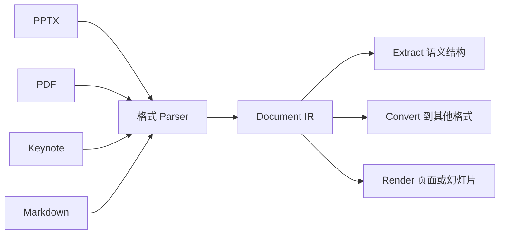

Document IR 是 DeckOps Parse 的标准化结果。每个源格式 Parser 都会把原生包结构、对象模型、布局规则和内容转换成共享 Schema。



共享 IR 避免为每一种源格式和目标格式组合分别实现一条转换链路。PPTX Parser 和 Keynote Parser 都可以输出 Document IR；PPTX Writer、PDF Writer 或 Renderer 再消费同一套标准化表示。

## IR 需要保留什么

准确 Schema 会随实现发布，但 IR 的目标是保留下游操作需要的信息：

- 文档、章节、页面、幻灯片和工作表层级。
- 画布或页面几何、坐标系、顺序和组合关系。
- Title、Subtitle、Body、Caption、Footnote 等语义角色。
- Text Run、样式、段落、列表和语言信息。
- 图片、形状、表格、图表、公式和嵌入资源。
- Speaker notes、评论、标注、超链接和其他非画布内容。
- 可以统一表达的格式专属行为，例如切换效果或工作簿规则。

## Parse

Parse 是格式专属的 Lowering 阶段：

```text
源文件字节 → 格式 Parser → Document IR
```

Parse 不会停留在文档级统计，而是恢复页面和元素结构、语义角色、内容、样式、几何和关系，使下游功能无需重新打开原始格式。

## Extract

Extract 从 IR 中选择适合消费的语义投影。例如，演示文稿的某一页可以表示为：

```json
{
  "page": 3,
  "title": "季度经营表现",
  "subtitle": "收入与利润率",
  "charts": [],
  "speakerNotes": "重点说明区域收入结构变化。",
  "footnotes": ["来源：内部经营数据"]
}
```

这与纯文本提取不同，因为页面边界、语义角色和类型化对象仍然明确存在。

## Convert

Convert 在 IR 之上调用目标格式 Writer 或 Generator：

```text
PPTX → Document IR → PDF
Keynote → Document IR → PPTX
Markdown → Document IR → PPTX
```

支持的源格式和目标格式矩阵应以未来实现为准，而不是从架构示例中推断。

## Document Information

Document Information 是从解析后 IR 派生出的文档级摘要或开发者视图，可展示文件身份、结构统计和内容组成，但不取代 IR 本身。

<Warning>
  本页定义 Document IR 的架构角色。具体 Node 类型、字段名、保真保证和支持的转换，需要在 DeckOps 源码及正式契约可用后确认。
</Warning>
