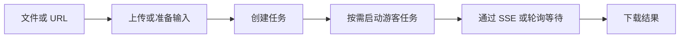

DeckOps 为需要可检索文本、格式专属结构或新文件产物的应用提供云端文档能力。发送支持的文件或 URL，即可解析内容、保留有用的文档结构、转换格式，或执行更广泛的文档操作。

| | 快速了解 |
| --- | --- |
| 适用场景 | 服务端解析、提取、转换和文档工作流 |
| 输入 | PDF、PPTX、DOCX、Keynote、受支持的转换输入，或 HTML URL |
| 结果 | Markdown、与格式对应的 JSON，或 PDF、图片、视频、HTML、PPTX 等文件 |
| 执行位置 | DeckFlow 云端 |
| 接入方式 | 已发布的 TypeScript 任务 SDK 和 CLI；Python、Go 实现当前需要检出源码 |
| 认证 | API Key 或用户 Token；底层任务支持受限的游客模式 |

## 适合使用 DeckOps 的场景

- 把 PDF、PPTX、DOCX 或 Keynote 解析成 Markdown，用于检索、审阅或 AI 工作流。
- 保留幻灯片几何信息、演讲者备注、文档元素或 PDF 语义角色等格式专属结构。
- 把支持的文档转换成可视化或可编辑产物。
- 在云端执行 OCR、演示文稿检查、压缩、拆分、合并、字体、图片或内容任务。

DeckOps 当前没有对外提供一个跨格式统一的 Document IR。高层 `parse()` 接口把支持的解析结果统一为 Markdown；底层解析任务则为每种格式保留不同的结构化契约。持久化或转换这些响应前，请先阅读[结构化解析结果](/zh/deckops/structured-results)。

## 云端操作如何执行



## 第一个云端任务

```ts
import { createDeck } from '@deckops/sdk';

const deck = createDeck();
const task = await deck.convertHtmlToPng({ files: ['./sample.html'] });
await deck.tasks.start(task.id); // 游客任务必须显式启动
const completed = await deck.tasks.wait(task.id);
const result = await deck.tasks.down(completed.id);

console.log(completed.id, completed.type, completed.status);
console.log(result);
```

这条已发布软件包路径会上传文件、显式启动游客任务、等待完成并下载结果。完整可运行流程见[快速开始](/zh/deckops/quick-start)。

<Warning>
  仓库源码实现了 `parse()`、`parseDetailed()` 和类型化 Parse 任务，但当前 `@deckops/sdk@0.7.3` npm 产物没有暴露这些接口。在修正后的产物发布前，Parse 文档属于源码契约说明。Python 当前未发布到 PyPI，Go Module 也无法通过其仓库地址获取。
</Warning>

## 执行与数据边界

DeckOps 处理的文件会上传到 DeckFlow 云端。已认证任务会自动启动；游客创建的底层任务必须先显式启动再等待，高层解析接口不会替你启动游客任务。

<Warning>
  使用 `parse()` 和 `parseDetailed()` 时请配置 API Key 或用户 Token。需要游客模式时，请使用底层任务 API，并在创建后调用 `tasks.start(task.id)`。Python SDK 当前没有提供这个游客启动方法。
</Warning>

## 继续阅读

<CardGroup cols={2}>
  <Card title="快速开始" href="/zh/deckops/quick-start">完成并验证一次已认证的 PDF 解析。</Card>
  <Card title="认证" href="/zh/deckops/authentication">选择游客、API Key 或用户 Token。</Card>
  <Card title="任务模型" href="/zh/deckops/task-model">处理任务创建、进度、重试和下载。</Card>
  <Card title="能力" href="/zh/deckops/operations">查找与工作流匹配的任务类型。</Card>
</CardGroup>
