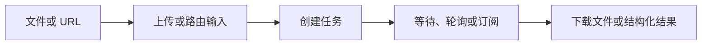

DeckOps 是 Deckflow 的云端文档处理运行时，将文件上传、异步任务、结构化解析、信息提取、格式转换和结果交付统一在 CLI 与 SDK 接口之后。

<CardGroup cols={2}>
  <Card title="快速开始" href="/zh/deckops/quick-start">
    解析第一个文档并读取任务结果。
  </Card>
  <Card title="任务模型" href="/zh/deckops/task-model">
    了解上传、异步执行、进度和结果下载。
  </Card>
  <Card title="解析文档" href="/zh/deckops/parse">
    获取 Markdown，或保留各格式的结构化解析结果。
  </Card>
  <Card title="文档操作" href="/zh/deckops/operations">
    查看格式转换、PPTX、OCR、压缩和内容任务。
  </Card>
</CardGroup>

## 能力分类

| 分类 | 提供的能力 |
| --- | --- |
| Parse | 解析 PDF、PPTX、DOCX 和 Keynote，或从网页 URL 提取可读内容 |
| Extract | 检查 PPTX 字体、文本形状、布局、图片和演讲者备注，以及图片 OCR |
| Convert | 在支持的组合中转换为 PDF、图片、视频、HTML 或 PPTX |
| Operate | 压缩文件、拆分或合并 PPTX、嵌入字体、缩放或转码图片 |
| 内容工作流 | 通过云端任务创建、翻译或改版文档内容 |

## 结构化结果，而不是一套公开统一 IR

当前 SDK 为不同格式公开不同的结构化结果契约。`deck.parse()` 提供归一化的 Markdown 便利结果；底层解析任务则保留 PPTX 几何、DOCX 元素类型、PDF 语义角色或 Keynote 幻灯片结构等格式专属信息。

在依赖解析字段开发前，请先阅读[结构化解析结果](/zh/deckops/structured-results)。

## 可用接入方式

- 面向 Node.js 和浏览器的 TypeScript SDK：`@deckops/sdk`
- Python SDK：`deckops-sdk`
- Go SDK：`github.com/deckops/deckops/sdks/go`
- npm Node.js CLI，以及通过 GitHub Releases 分发的原生 Go CLI

<Info>
  DeckOps 在云端执行文档任务。客户端可以使用稳定的访客 UUID、用户 Token 或 API Key；服务端调用限制取决于认证方式。
</Info>
