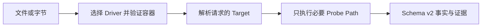

DeckProbe 在不打开或渲染文件、不运行宏，也不启动 Microsoft Office、Apple iWork 等桌面套件的前提下，检查预先定义的文档事实。它返回格式、页数或幻灯片数量、加密状态、资源清单等有明确名称且可验证的属性；不回答文档内容或语义问题，也不构建页面与元素级内容模型。

原生 CLI 从磁盘惰性读取。JavaScript SDK 设计为通过 WebAssembly 在浏览器和 Node.js 中复用同一套 Rust 引擎；选择该接入方式前，请先查看下方的发布状态。

| 项目 | 当前契约 |
| --- | --- |
| 输入 | PDF；现代与旧版 Word、Excel、PowerPoint；现代 Keynote、Numbers、Pages |
| 结果 | Schema v2 JSON，包含 Target 值、证据、置信度、诊断和实际 I/O 成本 |
| 执行位置 | 本地原生进程或本地 WebAssembly；文档字节不会发送给 Deckflow |
| 接入方式 | 原生 CLI 和 npm CLI；⚠ Browser、Worker、Node.js npm 发布阻塞 |
| 认证 | 不需要 |

## DeckProbe 适合什么

- 接收上传文件前，验证它声明的格式。
- 读取数量、元数据、结构事实、安全信号或资源清单。
- 根据证据而不是扩展名，把文档路由给 DeckOps 或 DeckRender。
- 限制物理读取、解压、归档条目和时间预算。
- 为策略引擎、批量盘点或 Agent 工具生成稳定 JSON。

<Tip>
  关闭 Telemetry 时，默认报告是确定性的。仅在报告需要包含耗时信息时启用 Telemetry。
</Tip>

<Warning>
  当前 `@deckflow/deckprobe@2.3.0` npm 产物缺少 JavaScript 导入所需的 `dist/` 和 `wasm/` 运行文件。原生 CLI 和 npm 提供的 CLI 可以使用，但该产物中的 Browser、Worker 和 Node.js API 无法运行。
</Warning>

## 选择接入方式

<CardGroup cols={2}>
  <Card title="原生 CLI" href="/zh/deckprobe/quick-start">
    适合大文件、批处理、stdin、JSONL 服务和严格的进程退出处理。
  </Card>
  <Card title="Browser SDK 源码契约" href="/zh/deckprobe/browser-sdk">
    查看已实现 API 和当前 npm 发布阻塞。
  </Card>
  <Card title="Node.js 源码契约" href="/zh/deckprobe/node-sdk">
    查看已实现 API 和当前 npm 发布阻塞。
  </Card>
  <Card title="格式与 Target" href="/zh/deckprobe/formats-and-targets">
    查看文档类型、当前例外、Target 发现和 Probe Level。
  </Card>
</CardGroup>

<Card title="打开 Deck Playground ↗" href="https://deckflow.github.io/playground/">
  在浏览器中检查文档 Profile 和 DeckProbe 事实。Playground 展示的页面预览属于组合页面能力，并不是 DeckProbe 报告的输出。
</Card>

## 能力边界

DeckProbe 返回文档事实，不返回像素或完整内容模型。它不执行 OCR、宏、外部链接，不修改文件，也不返回 DeckOps 解析结果。

- 需要图片、PDF、缩略图或视频时，使用 [DeckRender](/zh/deckrender/overview)。
- 需要页面与元素内容、Markdown、提取或转换时，使用 [DeckOps](/zh/deckops/overview)。
- 需要修改现有 PPTX 中支持的属性时，使用 [DeckUse](/zh/deckuse/overview)。

DeckProbe 是开源项目。版本和实现细节请查看 [DeckProbe 仓库](https://github.com/deckflow/deckprobe)。
