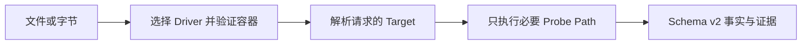

DeckProbe 帮助应用和 Agent 在接收、路由或处理文档前，先完成结构化验证。它返回实际格式、页数或幻灯片数量、加密状态、元数据和资源清单等有明确名称且可验证的事实，生成的 JSON 可以直接用于业务判断。整个检查过程在本地执行。

| 项目 | 快速了解 |
| --- | --- |
| 输入 | PDF；现代与旧版 Word、Excel、PowerPoint；现代 Keynote、Numbers、Pages |
| 结果 | Schema v2 JSON，包含 Target 值、证据、置信度、诊断和实际 I/O 成本 |
| 执行位置 | 本地原生进程或本地 WebAssembly；文档字节不会发送给 DeckFlow |
| 接入方式 | 原生 CLI、npm CLI、Browser SDK、Web Worker SDK 和 Node.js API |
| 认证 | 不需要 |

## DeckProbe 适合什么

- 应用接收或存储上传文件前的预检。
- 批量盘点文档格式、数量、元数据、安全信号和内嵌资源。
- 根据验证后的事实而不是扩展名，把文件路由到解析或渲染流程。
- 为策略检查提供稳定的 JSON、证据、置信度和诊断信息。
- 在浏览器、服务端、CI 或 Agent 流程中本地处理，不上传文档字节。

## 检查过程

DeckProbe 会选择对应 Driver、验证文件容器，并只执行请求的 Target 所需的 Probe Path。调用方可以限制文件读取量、解压量、归档条目数量和协作式执行时间。

## 选择接入方式

<CardGroup cols={2}>
  <Card title="原生 CLI" href="/zh/deckprobe/quick-start">
    适合大文件、批处理、stdin、JSONL 服务和严格的进程退出处理。
  </Card>
  <Card title="Browser 与 Worker SDK" href="/zh/deckprobe/browser-sdk">
    在浏览器主线程本地探测文件，或把较大的任务交给 Web Worker。
  </Card>
  <Card title="Node.js API" href="/zh/deckprobe/node-sdk">
    在 Node.js 20+ 应用中探测文件路径或字节数组。
  </Card>
  <Card title="格式与 Target" href="/zh/deckprobe/formats-and-targets">
    查看支持的文档类型、Target 发现和 Probe Level。
  </Card>
</CardGroup>

  <Card title="体验 Deck Playground" icon="flask" iconType="solid" href="https://deckflow.github.io/playground/" cta="打开 Playground ↗" arrow>
    在浏览器中检查文档 Profile 和 DeckProbe 事实。Playground 展示的页面预览属于组合页面能力，并不是 DeckProbe 报告的输出。
  </Card>

## 能力边界

DeckProbe 返回文档事实，不返回像素或完整内容模型。它不执行 OCR、宏、外部链接，不修改文件，也不返回 DeckOps 解析结果。

- 需要图片、PDF、缩略图或视频时，使用 [DeckRender](/zh/deckrender/overview)。
- 需要页面与元素内容、Markdown、提取或转换时，使用 [DeckOps](/zh/deckops/overview)。
- 需要修改现有 PPTX 中支持的属性时，使用 [DeckUse](/zh/deckuse/overview)。

DeckProbe 是开源项目。版本和实现细节请查看 [DeckProbe 仓库](https://github.com/deckflow/deckprobe)。
