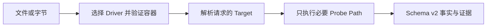

DeckProbe 在不打开或渲染文件、不运行宏，也不启动 Microsoft Office、Apple iWork 等桌面套件的前提下，检查预先定义的文档事实。它返回格式、页数或幻灯片数量、加密状态、资源清单等有明确名称且可验证的属性；不回答文档内容或语义问题，也不构建页面与元素级内容模型。

| 项目 | 当前契约 |
| --- | --- |
| 输入 | PDF；现代与旧版 Word、Excel、PowerPoint；现代 Keynote、Numbers、Pages |
| 结果 | Schema v2 JSON，包含 Target 值、证据、置信度、诊断和实际 I/O 成本 |
| 执行位置 | 本地原生进程或本地 WebAssembly；文档字节不会发送给 DeckFlow |
| 接入方式 | 原生 CLI、npm CLI、Browser SDK、Web Worker SDK 和 Node.js API |
| 认证 | 不需要 |

<Note>
  2.3.1 已修复 JavaScript 软件包内容，并通过 Browser 与软件包完整性检查。如果 `npm view @deckflow/deckprobe version` 仍返回 2.3.0，请暂时使用原生 CLI，或按照 SDK 页面从源码构建 2.3.1 软件包，等待 Registry 同步。
</Note>

## DeckProbe 适合什么

- 接收上传文件前，验证它声明的格式。
- 读取数量、元数据、结构事实、安全信号或资源清单。
- 根据证据而不是扩展名，把文档路由给 DeckOps 或 DeckRender。
- 限制物理读取、解压、归档条目和时间预算。
- 为策略引擎、批量盘点或 Agent 工具生成稳定 JSON。

## 选择接入方式

<CardGroup cols={2}>
  <Card title="原生 CLI" href="/zh/deckprobe/quick-start">
    适合大文件、批处理、stdin、JSONL 服务和严格的进程退出处理。
  </Card>
  <Card title="Browser 与 Worker SDK" href="/zh/deckprobe/browser-sdk">
    在浏览器主线程本地探测文件，或把较大的任务交给 Web Worker。
  </Card>
  <Card title="Node.js API" href="/zh/deckprobe/node-sdk">
    在 Node.js 20+ 应用中探测文件路径或字节数组。
  </Card>
  <Card title="格式与 Target" href="/zh/deckprobe/formats-and-targets">
    查看文档类型、当前例外、Target 发现和 Probe Level。
  </Card>
</CardGroup>

  <Card title="体验 Deck Playground" icon="flask" iconType="solid" href="https://deckflow.github.io/playground/" cta="打开 Playground ↗" arrow>
    在浏览器中检查文档 Profile 和 DeckProbe 事实。Playground 展示的页面预览属于组合页面能力，并不是 DeckProbe 报告的输出。
  </Card>

## 能力边界

DeckProbe 返回文档事实，不返回像素或完整内容模型。它不执行 OCR、宏、外部链接，不修改文件，也不返回 DeckOps 解析结果。

- 需要图片、PDF、缩略图或视频时，使用 [DeckRender](/zh/deckrender/overview)。
- 需要页面与元素内容、Markdown、提取或转换时，使用 [DeckOps](/zh/deckops/overview)。
- 需要修改现有 PPTX 中支持的属性时，使用 [DeckUse](/zh/deckuse/overview)。

DeckProbe 是开源项目。版本和实现细节请查看 [DeckProbe 仓库](https://github.com/deckflow/deckprobe)。
