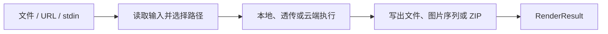

DeckRender 是面向文档的视觉产物路由器。它接收一个本地文件、HTTP(S) URL 或标准输入流，选择已经实现的源格式到目标格式路径，执行任务，并写出单个文件、连续编号图片或 ZIP。

| 项目 | 当前契约 |
| --- | --- |
| 输入 | PowerPoint、PDF、Keynote、Word、HTML、Markdown、Pages、Numbers 的已支持路径 |
| 输出 | PNG、JPEG、WebP 图片；PDF；MP4 视频 |
| 接入方式 | `deckrender` CLI 和 `@deckflow/deckrender` Node.js API |
| 执行位置 | 多数使用 Deckflow 云端任务，另有本地 PDF 透传和 iWork 预览提取 |
| 认证 | 可选访客模式、浏览器登录、Token 或 API Key |

## DeckRender 适合什么

- 页面或幻灯片预览和缩略图。
- 用于评审、搜索或视觉流程的 PNG、JPEG、WebP 图片。
- 从支持的演示文稿、文档或 HTML 生成 PDF。
- 从 PowerPoint 生成 MP4，或通过 PPTX 路径从 HTML 生成 MP4。
- 不直接管理 DeckOps 任务链，也能得到稳定的产物与结果契约。

DeckRender 不解析文本或文档元素，不返回 Document IR，也不编辑源内容。它的 `RenderPlan` 只描述执行路径。

## 数据与执行边界

多数格式会上传到 Deckflow 云端任务。本地 PDF 转 PDF 会直接透传，不上传文件。Pages 与 Numbers 在本地提取内嵌的第一页 JPEG 预览，并不是完整的 iWork 渲染。

HTTP(S) URL 由本地 Node.js 进程获取。HTML 会补充用于解析相对资源的 Base URL，再作为源内容上传。DeckRender 不会捕获用户浏览器当前的状态、Cookie 或认证会话。

<Warning>
  HTML 转 PDF 和 HTML 转视频会先把 HTML 重建为 PPTX。结果遵循幻灯片模型，并不是原生打印布局或在线页面录制。
</Warning>

## 从这里开始

<CardGroup cols={2}>
  <Card title="快速开始" href="/zh/deckrender/quick-start">
    创建最小 HTML 输入、渲染一张 PNG，并验证结果。
  </Card>
  <Card title="支持的格式" href="/zh/deckrender/formats">
    检查已实现路径、输出编码和保真限制。
  </Card>
  <Card title="认证" href="/zh/deckrender/authentication">
    选择访客模式、浏览器登录、API Key 或 CI 环境变量。
  </Card>
  <Card title="CLI" href="/zh/deckrender/cli/overview">
    控制输入形式、输出命名、页面筛选、尺寸和 Profile。
  </Card>
  <Card title="Node.js SDK" href="/zh/deckrender/sdk/node">
    在代码中渲染，并接收进度、警告和 `RenderResult`。
  </Card>
  <Card title="结果契约" href="/zh/deckrender/reference/result-contract">
    消费路径、页数、写出产物、限制和类型化错误。
  </Card>
</CardGroup>

只需要文档事实时使用 [DeckProbe](/zh/deckprobe/overview)，需要结构化内容和更多云端操作时使用 [DeckOps](/zh/deckops/overview)，需要修改现有 PPTX 时使用 [DeckUse](/zh/deckuse/overview)。

DeckRender 是开源项目，源码请查看 [DeckRender 仓库](https://github.com/deckflow/deckrender)。
