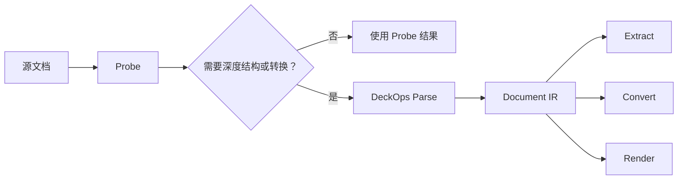

# DeckProbe 与 DeckOps

DeckProbe 是聚焦文件嗅探的引擎；DeckOps 是完整文档运行时，除了 Probe 和 Render，还提供 Parse、Extract 和 Convert。

| 维度 | DeckProbe | DeckOps |
| --- | --- | --- |
| 主要目标 | 快速、目标式文档嗅探 | 端到端文档理解与转换 |
| 执行方式 | 本地原生 Rust 或 Browser JS SDK | 通过 SDK 调用云端执行能力 |
| 典型问题 | 这是什么文件、包含什么、数量是多少？ | 如何把文档转换成共享 IR、结构化提取结果或另一种格式？ |
| 信息粒度 | 带证据和实际成本的文档级 Target | 文档、页面或幻灯片、元素级 IR Node |
| 解析模型 | 只执行请求 Target 所需的 Probe Path | 格式专属 Parser 直接把文档降低成统一 Document IR |
| 提取结果 | 信号、数量、名称、尺寸和有边界的格式事实 | Title、Subtitle、Chart、Speaker notes、Footnotes 等页面语义结构 |
| 格式转换 | 不负责转换 | 在支持格式矩阵范围内通过共享 IR 转换 |
| 渲染 | 不负责 | 组合运行时内置 Render |
| 源文件修改 | 不支持 | 不负责源文件感知回写；Manipulate 使用 DeckUse |

## 选择 DeckProbe

应用需要本地或浏览器内嗅探、确定性证据、明确置信度和有边界的 I/O，并希望 Browser SDK 不上传文档字节时，使用 DeckProbe。

可以打开 [Deck Playground](https://deckflow.github.io/playground/)，直观查看文档级 Profile、页面预览和后续操作入口。

## 选择 DeckOps

云端工作流需要以下一项或多项能力时，使用 DeckOps：

- 跨异构格式的统一 Document IR。
- 保留页面与语义角色的结构化 Extract，而不是纯文本。
- 基于共享 Parser 和 Writer 的格式 Convert。
- 把 Render 与 Probe、文档操作组合在同一运行时中。

## 运行流程

<Note>
  DeckProbe 的 `deep` 级别仍然返回 Target 证据，不会生成 DeckOps Document IR；“Deep”只表示 Target Planner 可使用更多 Probe Path 和预算。
</Note>
