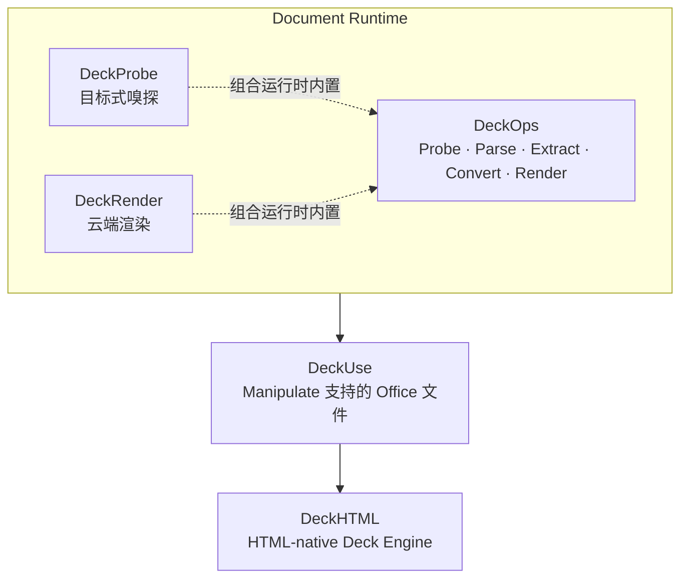

# 运行时架构

Deckflow 将文档能力组织为核心运行时、源文件操作层和专项 HTML-native Deck Engine。

纵向结构表达产品层次，不表示每个请求都必须依次调用所有产品。

## Document Runtime

- **DeckProbe** 提供独立的本地与浏览器嗅探；只需要目标式文件事实时，它是最小运行时。
- **DeckRender** 通过 SDK 提供云端渲染，用于生成页面或幻灯片视觉产物。
- **DeckOps** 是能力最完整的云端运行时，围绕统一 Document IR，把 Probe 和 Render 与 Parse、Extract、Convert 组合起来。

## Manipulate Layer

**DeckUse** 操作支持的 Office 源文件。Office 文件仍需作为可编辑产物，并需要修改或删除元素时，使用 DeckUse。

## HTML-native Engine

**DeckHTML** 专门支持以 HTML 创作 Deck 的趋势，通过本地和云端执行路径，将 HTML 布局生成演示文稿产物。

## 能力映射

| 能力 | 主要产品 |
| --- | --- |
| Probe | DeckProbe；DeckOps 也内置该能力 |
| Parse 成 Document IR | DeckOps |
| Extract 页面语义结构 | DeckOps |
| Convert 文档格式 | DeckOps |
| Render | DeckRender；DeckOps 也内置该能力 |
| Manipulate 支持的 Office 文件 | DeckUse |
| 从 HTML 构建 Deck | DeckHTML |
