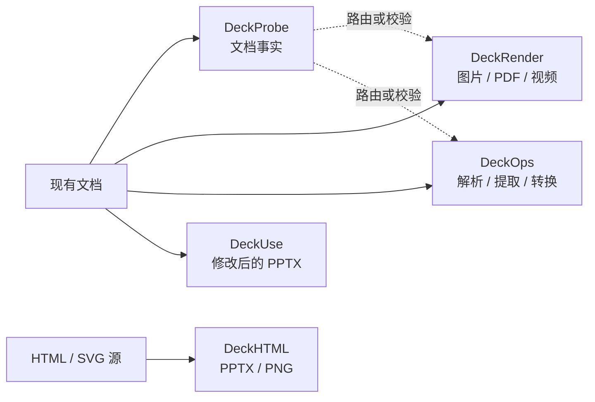

  面向开发者的文档运行时
  <h2 className="deckflow-hero-title">一套文档能力，交付五种明确结果</h2>
  
无需打开文件即可检查事实，生成稳定预览，执行云端文档任务，修改现有 PPTX，或从 HTML 生成新的演示文稿。

  

    本地优先检查
    云端文档任务
    可编辑 PPTX 工作流
  

## 从最终结果开始

<CardGroup cols={2}>
  <Card title="打开前检查文档" icon="magnifying-glass" iconType="solid" color="#14b8a6" href="/zh/deckprobe/overview" cta="了解 DeckProbe" arrow>
    <strong>DeckProbe</strong> 在本地读取文档身份、元数据、结构、安全信号和资源事实，无需启动 Office 或 iWork。
  </Card>
  <Card title="渲染文档" icon="images" iconType="solid" color="#3b82f6" href="/zh/deckrender/overview" cta="了解 DeckRender" arrow>
    <strong>DeckRender</strong> 把支持的文件路由成图片、PDF 或视频，并按稳定规则写出产物。
  </Card>
  <Card title="执行文档操作" icon="cube" iconType="solid" color="#8b5cf6" href="/zh/deckops/overview" cta="了解 DeckOps" arrow>
    <strong>DeckOps</strong> 提供云端解析、提取、转换、生成和异步任务执行能力。
  </Card>
  <Card title="修改现有 PPTX" icon="pen-to-square" iconType="solid" color="#f59e0b" href="/zh/deckuse/overview" cta="了解 DeckUse" arrow>
    <strong>DeckUse</strong> 替换指定文本、移动受支持的形状，最终生成仍可编辑的 PPTX。
  </Card>
  <Card title="使用 HTML 创作 Deck" icon="code" iconType="solid" color="#ec4899" href="/zh/deckhtml/overview" cta="了解 DeckHTML" arrow>
    <strong>DeckHTML</strong> 将浏览器布局映射为 PPTX 或 PNG，并报告哪些元素保持可编辑、哪些会降级为图片。
  </Card>
</CardGroup>

## 五个产品如何协作

DeckProbe 与 DeckUse 在本地执行。DeckRender 根据路径采用本地、透传或 Deckflow 云端执行。DeckOps 在云端运行文档任务。DeckHTML 同时支持本地浏览器转换和云端模式。

## 比较执行边界

| 使用目标 | 产品 | 主要接入方式 | 认证 |
| --- | --- | --- | --- |
| 验证格式、数量、元数据、结构或风险信号 | [DeckProbe](/zh/deckprobe/overview) | 原生或 npm CLI；JavaScript SDK 等待软件包修正 | 不需要；文件留在本地 |
| 生成页面图片、PDF、缩略图或视频 | [DeckRender](/zh/deckrender/overview) | CLI 或 Node.js SDK | 云端路径可选；支持访客模式 |
| 解析、提取、转换、生成或编排云端任务 | [DeckOps](/zh/deckops/overview) | 已发布 TypeScript 任务 SDK 或 CLI；源码中的 Python/Go 实现 | 高层 Parse 需要凭证；底层任务提供受限游客模式 |
| 替换现有 PPTX 的文本或移动受支持的形状 | [DeckUse](/zh/deckuse/overview) | CLI；Node.js 软件包当前存在阻塞 | 不需要；文件留在本地 |
| 从 HTML 或 SVG 生成 PPTX 或 PNG | [DeckHTML](/zh/deckhtml/overview) | CLI 或 Node.js SDK | 本地模式不需要；云端模式可选 |

<Note>
  每个产品支持的格式和操作范围不同。某个产品能识别文件，不代表其他产品也能处理。请以各产品的支持格式或命令参考页作为当前版本契约。
</Note>

## 开始接入

<Steps>
  <Step title="先确定最终产物">
    判断流程最终需要文档事实、视觉文件、结构化内容、修改后的源文件，还是从 HTML 生成的 Deck。
  </Step>
  <Step title="跑通一个完整示例">
    打开[开始使用](/zh/getting-started)，查看五个产品最短的安装、调用和结果路径。
  </Step>
  <Step title="对应应用工作流">
    需要把校验、解析、渲染或生成组合成一条应用路径时，查看[常见工作流](/zh/common-workflows)。
  </Step>
  <Step title="改造一个可运行示例">
    打开[示例](/zh/examples/overview)，从带有明确输入和预期输出的完整任务配方开始。
  </Step>
</Steps>

<Columns cols={2}>
  <Card title="还不确定该选哪个产品？" icon="route" iconType="solid" href="/zh/product-guide" horizontal>
    对比输入、输出、执行位置和产品边界。
  </Card>
  <Card title="已经准备复制代码？" icon="flask" iconType="solid" href="/zh/examples/overview" horizontal>
    从自包含示例开始，而不是在多个参考页面之间拼接调用链路。
  </Card>
</Columns>
